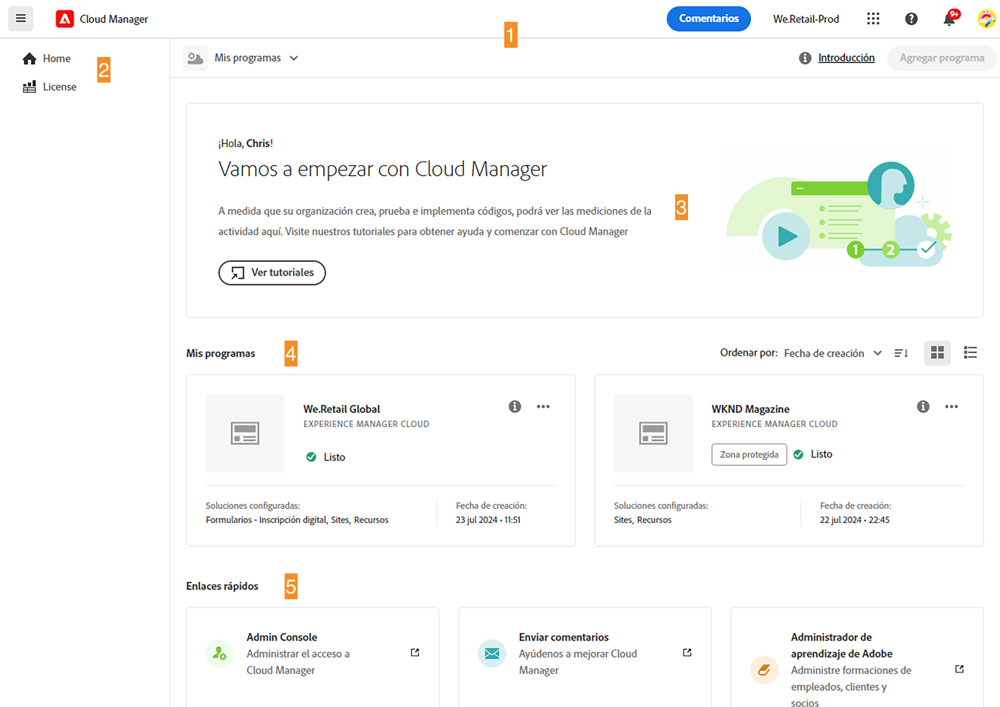
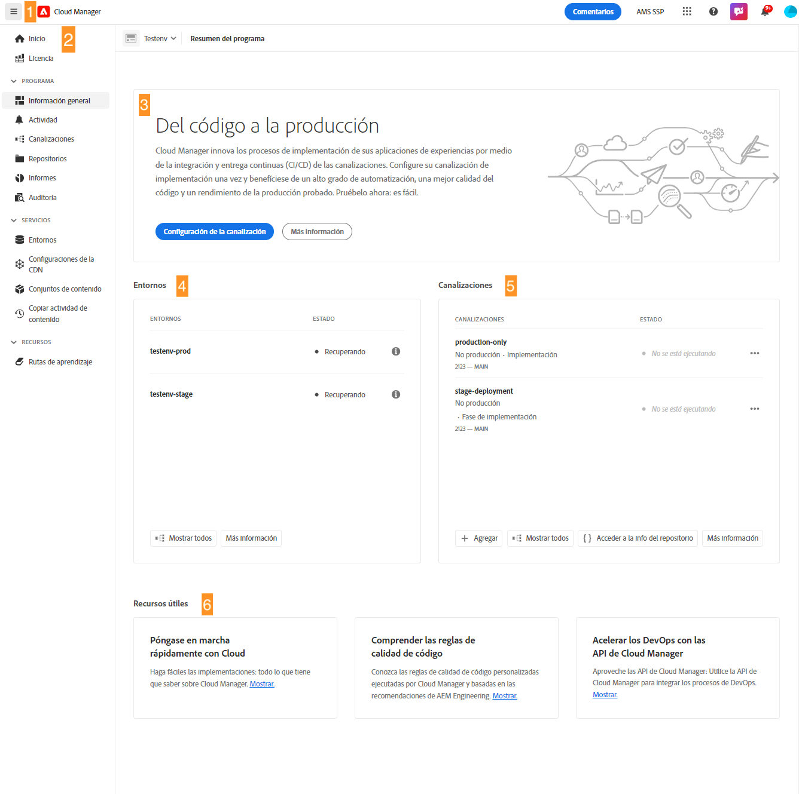

# Navegación por la IU de Cloud Manager {#navigation}

Descubra cómo está organizada la IU de Cloud Manager y cómo navegar para administrar sus programas y entornos.

La IU de Cloud Manager está compuesta principalmente por dos interfaces gráficas:

* [En la consola Mis programas](#my-programs-console) podrá ver y administrar todos sus programas.
* [La ventana Información general del programa](#program-overview) es donde puede ver los detalles de un programa individual y administrarlo.

## Consola Mis programas {#my-programs-console}

Al iniciar sesión en Cloud Manager en [my.cloudmanager.adobe.com](https://my.cloudmanager.adobe.com/) y seleccionar la organización adecuada, se llega a la consola **Mis programas**.

La consola Mis programas proporciona información general de todos los programas a los que tiene acceso en la organización seleccionada. Se compone de partes.

1. [Barras de herramientas](#toolbars-my-programs-toolbars) para la selección de organizaciones, las alertas y la configuración de cuentas.
1. Fichas que permiten alternar la vista actual de los programas.

   * Vista **Inicio** (predeterminada) que selecciona la vista **Mis programas** con una descripción general de todos los programas.
   * **Licencia** que accede al Tablero de licencias. El Tablero de licencias solo se aplica a *programas de AEM as a Cloud Service* (AEMaaCS), no a programas de AMS. Para determinar el tipo de servicio que tiene su programa (AEMaaCS o AMS), consulte la [sección Tarjetas de programa](#program-cards) de este artículo.
   * Las pestañas se cierran de forma predeterminada y se pueden mostrar mediante el menú desplegable de iconos de hamburguesa, que se encuentra a la izquierda del [encabezado de Cloud Manager](#cloud-manager-header).

1. [Llamadas a la acción y Estadísticas](#cta-statistics) para obtener información general de su actividad reciente
1. [**Sección Mis programas**](#my-programs-section) con información general de todos sus programas
1. [Vínculos rápidos](#quick-links) para acceder fácilmente a recursos relacionados

>[!TIP]
>
>Consulte [Programas y tipos de programas](/help/getting-started/program-setup.md) para obtener más información sobre los programas.

### Barras de herramientas {#my-programs-toolbars}

Hay dos barras de herramientas una encima de la otra.

#### encabezado de Cloud Manager {#cloud-manager-header}

El primero es el encabezado de Cloud Manager. El encabezado se mantiene a medida que navega por Cloud Manager. Es un anclaje que le permite acceder a la configuración y a la información que se aplican a todos los programas de Cloud Manager.

1. El icono de hamburguesa de la izquierda del encabezado es un menú desplegable que proporciona acceso a las pestañas de partes específicas de un programa individual. Según el contexto, también le permite cambiar entre el Tablero de licencias y la consola **[Mis programas](#my-programs-console)**.
   * El Tablero de licencias solo se aplica a programas de AEM as a Cloud Service, no de AMS.
   * Para determinar el tipo de servicio que tiene su programa (AMS o AEMaaCS), consulte la [sección Tarjetas de programa](#program-cards) de este documento.
1. El botón Cloud Manager le lleva de nuevo a la consola Mis programas de Cloud Manager, independientemente de dónde se encuentre en Cloud Manager.
1. Haga clic en el botón Comentarios para proporcionar comentarios al Adobe sobre Cloud Manager.
1. El selector de organización muestra la organización en la que está conectado actualmente (en este ejemplo, Foundation Internal). Haga clic en para cambiar a otra organización si Adobe ID está asociado a varias.
1. Al hacer clic en el conmutador de soluciones, puede ir rápidamente a otras soluciones de Experience Cloud.
1. El icono Ayuda proporciona un acceso rápido a los recursos de aprendizaje y asistencia.
1. El icono de notificaciones está marcado con el número de [notificaciones](/help/using/notifications.md) incompletas asignadas actualmente
1. Seleccione el icono que representa a su usuario para acceder a la configuración. Si no selecciona una imagen de usuario, se asigna un icono de forma aleatoria.

#### Barra de herramientas Programa {#program-toolbar}

La barra de herramientas del programa proporciona vínculos para cambiar entre los programas de Cloud Manager y las acciones apropiadas para el contexto.

1. El selector de programas se abre en una lista desplegable en la que puede seleccionar rápidamente otros programas o realizar acciones adecuadas al contexto, como crear un nuevo programa.
1. El vínculo de introducción le da acceso a [recorrido de documentación de incorporación](https://experienceleague.adobe.com/es/docs/experience-manager-cloud-service/content/onboarding/journey/overview) para que pueda ponerse en marcha con Cloud Manager.
El recorrido de incorporación está diseñado para Cloud Manager en Adobe Experience Manager as a Cloud Service (AEMaaCS) y no para Cloud Manager en Adobe Managed Services (AMS). Sin embargo, muchos conceptos son los mismos.
1. El botón de acción ofrece acciones adecuadas al contexto, como crear un nuevo programa.

### Estadísticas y llamadas a la acción {#cta-statistics}

La sección de llamadas a la acción y estadísticas proporciona datos acumulados para su organización. Por ejemplo, si ha configurado correctamente sus programas, pueden mostrarse las estadísticas de sus actividades de los últimos 90 días, entre ellas:

* Número de [implementaciones](/help/using/code-deployment.md)
* Número de [problemas de calidad del código](/help/using/code-quality-testing.md) identificados
* Número de compilaciones

O si acaba de comenzar la configuración de su organización, puede haber sugerencias sobre los pasos siguientes o los recursos de documentación.

### Mis programas {#my-programs-section}

El contenido principal de la consola Mis programas es la sección **Mis programas** que enumera sus programas como tarjetas individuales. Haz clic en una tarjeta para acceder a la página **Resumen del programa** para obtener detalles sobre el programa.

>[!NOTE]
>
>Según sus privilegios, es posible que no pueda seleccionar determinados programas.

Utilice las siguientes opciones de clasificación para encontrar mejor el programa que necesita:

* Ordenar por
   * Fecha de creación (predeterminada)
   * Nombre del programa
   * Estado
* De subida (predeterminado)/De bajada
* Vista de cuadrícula (predeterminado)
* Vista de lista   

#### Tarjetas de programa {#program-cards}

Una tarjeta o fila de una tabla representa cada programa, lo que proporciona una descripción general del programa y vínculos rápidos para realizar acciones.

* Imagen del programa (si está configurada)
* Nombre del programa
* Tipo de servicio:
   * **Experience Manager** para programas de AMS
   * **Experience Manager Cloud** para [programas de AEM as a Cloud Service](https://experienceleague.adobe.com/es/docs/experience-manager-cloud-service/content/implementing/home)
* Estado
* Soluciones configuradas
* Fecha de creación

El icono de información también permite acceder rápidamente a la información adicional sobre el programa (útil en la vista de listas).

El icono de puntos suspensivos le permite acceder a acciones adicionales que puede realizar en el programa.

* Navegue a un [entorno](/help/using/managing-environments.md) particular del programa
* Abra la [información general del programa](#program-overview)
* [Edite el programa](/help/getting-started/program-setup.md)
* Mostrar monitorización

### Vínculos rápidos {#quick-links}

La sección de vínculos rápidos le permite acceder a recursos útiles relacionados.

## Ventana Resumen del programa {#program-overview}

Si selecciona un programa en la consola [**Mis programas**](#my-programs-console), accederá a la página **Información general del programa**.

La Información general del programa le permite acceder a todos los detalles de un programa de Cloud Manager. Al igual que la consola Mis programas, está formada por varias partes.

1. [Barras de herramientas](#program-overview-toolbar) para volver rápidamente a la consola de **Mis programas** y navegar por el programa.
1. [Tabs](#program-tabs) para cambiar entre diferentes aspectos del programa.
1. Una [llamada a la acción](#cta) basada en las últimas acciones del programa.
1. Una [descripción general de los entornos](#environments) del programa.
1. [descripción general de las canalizaciones](#pipelines) del programa.
1. Vínculos a [recursos útiles](#useful-resources).

### Barras de herramientas {#program-overview-toolbar}

Las barras de herramientas de la Información general del programa son similares a las barras de herramientas de la consola [Mis programas](#my-programs-toolbars). Aquí solo se ilustran las diferencias.

#### encabezado de Cloud Manager {#cloud-manager-header-2}

El encabezado de Cloud Manager tiene un menú desplegable de icono de hamburguesa que se abre automáticamente para mostrar las pestañas navegables de Información general del programa.

Haga clic en el icono de hamburguesa para ocultar las pestañas.

#### Barra de herramientas Programa {#program-toolbar-2}

La barra de herramientas del programa le permite cambiar a otros programas rápidamente, pero además le da acceso a acciones apropiadas para el contexto, como agregar y editar el programa.

Además, si oculta las pestañas con el icono de hamburguesa, la barra de herramientas puede mostrar la pestaña en la que se encuentra actualmente.

### Fichas de programa {#program-tabs}

Cada programa tiene numerosas opciones y datos asociados. Estos datos se recopilan en pestañas para facilitar la navegación por el programa. Las pestañas le permiten acceder a lo siguiente:

* Información general: la descripción general del programa tal como se describe en el documento actual
* [Actividad](/help/using/managing-pipelines.md#activity): el historial de ejecuciones de canalización del programa
* [Canalizaciones](/help/using/managing-pipelines.md#pipelines): todas las canalizaciones configuradas para el programa
* [Repositorios](/help/managing-code/managing-repositories.md): todos los repositorios configurados para el programa
* [Informes](/help/using/monitoring-environments.md#system-monitoring-overview): métricas como datos de SLA
* [Entornos](/help/using/managing-environments.md): todos los entornos configurados para el programa
* [Conjuntos de contenido](/help/using/content-copy.md): conjuntos de contenido creados con fines de copia
* [Copiar actividad de contenido](/help/using/content-copy.md): actividades de copia de contenido
* Rutas de aprendizaje: recursos de aprendizaje adicionales sobre Cloud Manager

De forma predeterminada, al abrir un programa, llega a la pestaña **Información general**. La pestaña actual está resaltada. Seleccione otra pestaña para mostrar sus detalles.

Use el icono de hamburguesa en el [encabezado de Cloud Manager](#cloud-manager-header-2) para ocultar las fichas.

### Llamada a acción {#cta}

La sección de llamada a la acción le proporciona información útil según el estado del programa. Para un programa nuevo, es posible que vea los pasos siguientes que se ofrecen y un recordatorio de una fecha de lanzamiento [establecida durante la creación del programa](/help/getting-started/program-setup.md).

Para un programa activo, el estado de la última implementación con vínculos para obtener más información e iniciar una nueva implementación.

### Tarjeta Entornos {#environments}

La tarjeta **Entornos** le ofrece una descripción general de sus entornos y vínculos para realizar acciones rápidas.

La tarjeta **Entornos** solo enumera tres entornos. Haga clic en **Mostrar todo** para ver todos los entornos del programa.

Consulte [Administración de entornos](/help/using/managing-environments.md) para obtener detalles sobre cómo administrar sus entornos.

### Tarjeta de canalizaciones {#pipelines}

La tarjeta **Canalizaciones** le ofrece una descripción general de sus canalizaciones y vínculos para realizar acciones rápidas.

La tarjeta **Canalizaciones** solo enumera tres canalizaciones. Haga clic en **Mostrar todo** para ver todas las canalizaciones del programa.

Consulte [Administración de canalizaciones](/help/using/managing-pipelines.md) para obtener detalles sobre cómo administrar sus canalizaciones.

### Recursos útiles {#useful-resources}

La sección **Recursos útiles** proporciona vínculos a recursos de aprendizaje adicionales para Cloud Manager.
