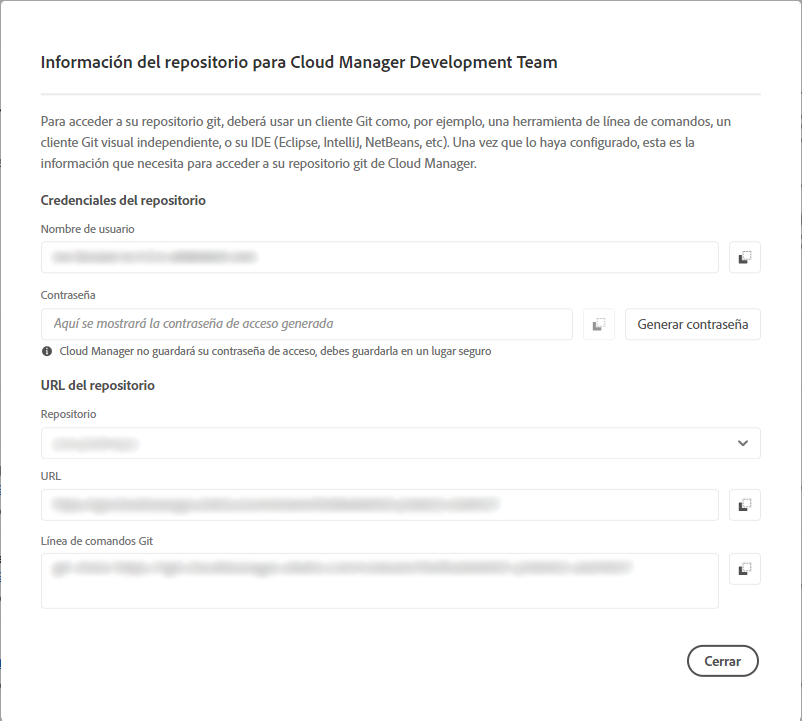

# Información de acceso al repositorio {#accessing-repos}

Obtenga información sobre cómo acceder y gestionar sus repositorios de Git administrados por Adobe mediante la administración de cuentas de Git de autoservicio desde Cloud Manager.

## Acceso a la información del repositorio desde la página de información general {#overview-page}

Con Cloud Manager, puede recuperar la información de acceso al repositorio de los repositorios administrados por Adobe mediante **Acceder a la info del repositorio** desde la tarjeta **Canalizaciones**.

El cuadro de diálogo **Información del repositorio** le permite ver la siguiente información de acceso para los repositorios administrados por Adobe:

* El nombre de usuario de Git.
* La contraseña de Git.
* La dirección URL del repositorio de Git de Cloud Manager.
* Comandos Git creados previamente para añadir un remoto al repositorio Git y código push.

  

La información de acceso de los [repositorios privados](/help/managing-code/private-repositories.md) no está disponible en Cloud Manager.

La función **Acceder a la info del repositorio** es visible para los usuarios con funciones de **Desarrollador** o **Administrador de implementación**.

**Para acceder a la información del repositorio desde la página de información general:**

1. Inicie sesión en Cloud Manager en [my.cloudmanager.adobe.com](https://my.cloudmanager.adobe.com/) y seleccione la organización y programa adecuados.

1. En la página **Resumen del programa**, en la tarjeta **Canalizaciones**, haga clic en **Acceder a la info del repositorio**.

   

1. Para acceder a la contraseña, debe generar una nueva contraseña. En el cuadro de diálogo **Información del repositorio**, seleccione **Generar contraseña**.

1. En el cuadro de diálogo de confirmación, seleccione **Generar contraseña**.

1. A la derecha del campo **Contraseña**, haga clic en el  para copiar la contraseña en el portapapeles.

   * La generación de la contraseña invalida la anterior.
   * Cloud Manager no guarda la contraseña. Es responsabilidad suya guardar la contraseña de forma segura.
   * Como Cloud Manager no guarda la contraseña, si la pierde, debe generar una nueva.

   

Con estas credenciales, puede clonar una copia local del repositorio, realizar cambios en ese repositorio local y, cuando esté listo, enviar los cambios de código de nuevo al repositorio de código remoto en Cloud Manager.

## Información de acceso al repositorio desde la ventana Repositorios {#repositories-window}

La función **Acceder a la info del repositorio** también está disponible en la página [**Repositorios**](/help/managing-code/managing-repositories.md). Muestra la misma información sobre el acceso a los repositorios administrados por Adobe.

## Revocar una contraseña de acceso {#revoke-password}

Puede revocar una contraseña de acceso en cualquier momento.

Para ello, [cree un vale de asistencia para esta solicitud](https://experienceleague.adobe.com/es?support-solution=Experience+Manager&support-tab=home&lang=es#support). Al ticket se le asigna una prioridad alta y, por lo general, se resuelve en un día.
