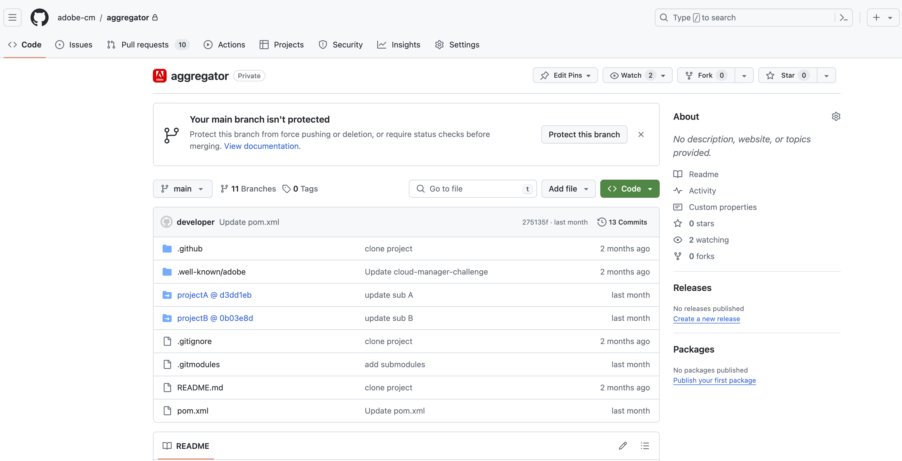

# Compatibilidad con los submódulos de Git para repositorios de Adobe {#git-submodule-support}

Los submódulos Git se pueden usar para combinar el contenido de varias ramas en repositorios Git en el momento de la compilación.

Cuando se ejecuta el proceso de generación de Cloud Manager, primero clona el repositorio de la canalización y extrae la rama configurada. Si la rama contiene un archivo `.gitmodules` en el directorio raíz, se ejecuta el comando.

```
$ git submodule update --init
```

Este proceso comprobará que cada submódulo esté en el directorio apropiado. Esta técnica es una alternativa potencial a [trabajar con varios repositorios Git de origen](/help/managing-code/multiple-git-repos.md) para organizaciones que se sienten cómodas con el uso de submódulos Git y no desean administrar un proceso de combinación externo.

Por ejemplo, supongamos que hay tres repositorios, cada uno de los cuales contiene una sola rama denominada `main`. En el repositorio &quot;principal&quot;, es decir, el configurado en las canalizaciones, la rama `main` tiene un archivo `pom.xml` que declara los proyectos contenidos en los otros dos repositorios:

```xml
<?xml version="1.0" encoding="UTF-8"?>
<project xmlns="http://maven.apache.org/POM/4.0.0" xmlns:xsi="http://www.w3.org/2001/XMLSchema-instance"
    xsi:schemaLocation="http://maven.apache.org/POM/4.0.0 http://maven.apache.org/maven-v4_0_0.xsd">
    <modelVersion>4.0.0</modelVersion>
   
    <groupId>customer.group.id</groupId>
    <artifactId>customer-reactor</artifactId>
    <version>0.0.1-SNAPSHOT</version>
    <packaging>pom</packaging>
   
    <modules>
        <module>project-a</module>
        <module>project-b</module>
    </modules>
   
</project>
```

Luego debe añadir submódulos para los otros dos repositorios:

```shell
$ git submodule add -b main https://git.cloudmanager.adobe.com/ProgramName/projectA/ project-a
$ git submodule add -b main https://git.cloudmanager.adobe.com/ProgramName/projectB/ project-b
```

Los resultados del archivo `.gitmodules` son los siguientes:

```text
[submodule "project-a"]
    path = project-a
    url = https://git.cloudmanager.adobe.com/ProgramName/projectA/
    branch = main
[submodule "project-b"]
    path = project-b
    url = https://git.cloudmanager.adobe.com/ProgramName/projectB/
    branch = main
```

Consulte el [manual de referencia de Git](https://git-scm.com/book/en/v2/Git-Tools-Submodules) para obtener más información sobre los submódulos Git.

## Limitaciones {#limitations}

Cuando utilice submódulos Git, tenga en cuenta las siguientes limitaciones:

* La dirección URL de Git debe ser exacta como la sintaxis descrita anteriormente.
* Por motivos de seguridad, no incluya credenciales en estas direcciones URL.
* Solo se admiten submódulos en la raíz de la rama.
* Las referencias del submódulo Git se almacenan en confirmaciones de Git específicas. Como resultado, cuando se realizan cambios en el repositorio de submódulos, es necesario actualizar la confirmación a la que se hace referencia. Por ejemplo, utilizando `git submodule update --remote`.
* A menos que sea necesario, Adobe recomienda usar submódulos &quot;superficiales&quot; ejecutando `git config -f .gitmodules submodule.<submodule path>.shallow true` para cada submódulo.


## Compatibilidad con los submódulos de Git para repositorios privados {#private-repositories}

La compatibilidad con los submódulos de Git al utilizar [repositorios privados](private-repositories.md) es prácticamente la misma que cuando se usan repositorios de Adobe.

Sin embargo, para que Cloud Manager detecte la configuración del submódulo, debe agregar un archivo `.gitmodules` al directorio raíz del repositorio del agregador después de configurar el archivo `pom.xml` y ejecutar los comandos `git submodule`.




### Limitaciones y recomendaciones {#limitations-recommendations-private-repos}

Cuando utilice submódulos de Git con repositorios privados, tenga en cuenta las siguientes limitaciones.

* Las direcciones URL de Git para los submódulos pueden estar en formato HTTPS o SSH, pero deben vincularse a un repositorio de github.com. Añadir un submódulo de repositorio de Adobe a un repositorio de agregación de GitHub, o viceversa, no funciona.
* Los submódulos de GitHub deben ser accesibles para la aplicación de Adobe GitHub.
* [Las limitaciones de uso de submódulos de Git con repositorios administrados por Adobe](#limitations-recommendations) también se aplican.
