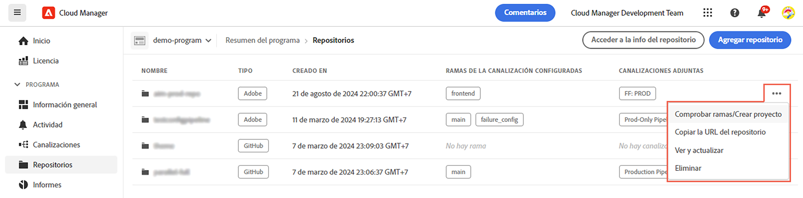
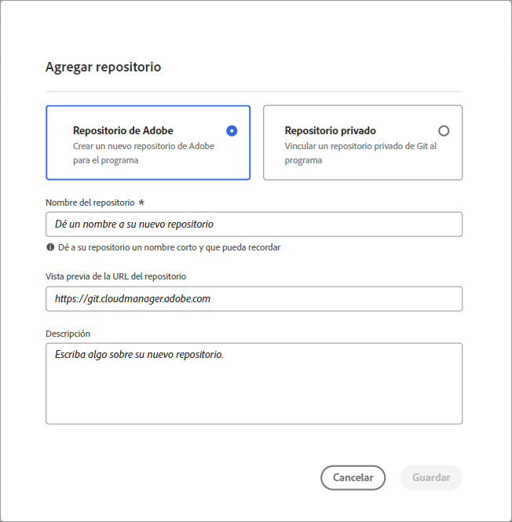
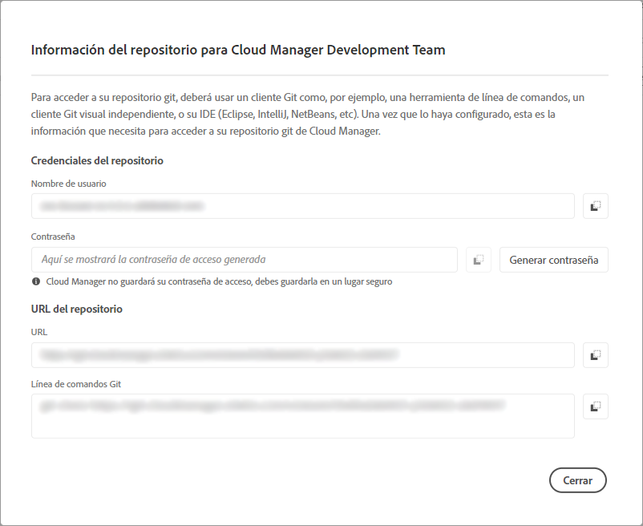
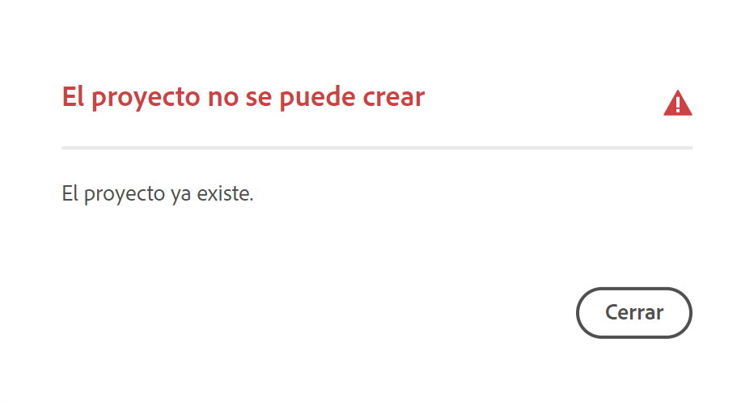
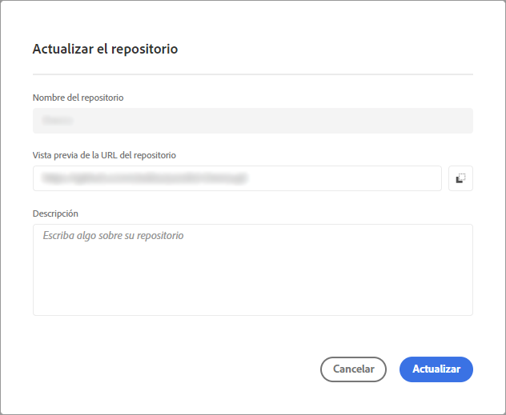

# Administración de repositorios en Cloud Manager {#cloud-manager-repos}

Obtenga información sobre cómo ver, agregar y eliminar un repositorio Git en Cloud Manager.

## Información general {#overview}

Los repositorios de Cloud Manager se utilizan para almacenar y administrar el código del proyecto mediante Git. Por cada *programa* que agregue, se creará automáticamente un repositorio administrado por Adobe.

Además, tiene la opción de crear más repositorios administrados por Adobe o agregar sus propios repositorios privados. Todos los repositorios vinculados a su programa se pueden ver en la página **Repositorios**.

Los repositorios creados en Cloud Manager también se pueden seleccionar al añadir o editar canalizaciones. Para obtener más información sobre la configuración de canalizaciones, consulte [Canalizaciones CI-CD](/help/overview/ci-cd-pipelines.md).

Cada canalización está vinculada a un repositorio o rama principal. Sin embargo, con [compatibilidad con el submódulo Git](/help/managing-code/git-submodules.md), se pueden incluir varias ramas secundarias durante el proceso de compilación.

## Ver la página Repositorios {#repositories-window}

En la página **Repositorios**, puede ver detalles sobre el repositorio seleccionado. Esta información incluye el tipo de repositorio en uso. Si el repositorio está marcado como **Adobe**, significa que es un repositorio administrado por el Adobe. Si está etiquetado como **GitHub**, hace referencia a un repositorio privado de GitHub que usted administra. Además, la página proporciona detalles como cuándo se creó el repositorio y las canalizaciones asociadas a él.

Para realizar acciones en un repositorio seleccionado, puede hacer clic en el repositorio y usar  para abrir un menú desplegable. Para los repositorios administrados por Adobe, puede **[Comprobar ramas / Crear proyecto](#check-branches)**.

*Menú desplegable en la página Repositorios.*

Otras acciones disponibles en el menú desplegable incluyen **[Copiar URL del repositorio](#copy-url)**, **[Ver y actualizar](#view-update)** y **[Eliminar](#delete)** el repositorio.

**Para ver la página Repositorios:**

1. Inicie sesión en Cloud Manager en [my.cloudmanager.adobe.com](https://my.cloudmanager.adobe.com/) y seleccione la organización y programa adecuados.

1. En la página **Resumen del programa**, en el menú lateral, haga clic en  **Repositorios**.

1. La página **Repositorios** muestra todos los repositorios asociados con el programa seleccionado.

   
   *La página Repositorios en Cloud Manager.*

## Añadir un repositorio {#adding-repositories}

Un usuario debe tener la función **Administrador de implementación** o **Propietario del negocio** para agregar un repositorio.

En la página **Repositorios**, cerca de la esquina superior derecha, haga clic en **Agregar repositorio**

*Cuadro de diálogo Agregar repositorio.*

Cloud Manager admite dos tipos de repositorios: repositorios administrados por Adobe (**Repositorio de Adobe**) y repositorios administrados automáticamente (**Repositorio privado**). Los campos obligatorios para la configuración varían según el tipo de repositorio que elija añadir. Para obtener más información, consulte lo siguiente:

* [Adición de repositorios de Adobe en Cloud Manager](/help/managing-code/adobe-repositories.md)
* [Adición de repositorios privados en Cloud Manager](/help/managing-code/private-repositories.md)

Hay un límite de 300 repositorios en todos los programas de cualquier compañía u organización de IMS.

## Acceder a información del repositorio {#repo-info}

Cuando vea sus repositorios en la ventana **Repositorios**, puede ver los detalles sobre cómo acceder programáticamente a los repositorios administrados por Adobe pulsando o haciendo clic en el botón **Acceder a la info del repositorio** en la barra de herramientas.

La ventana **Información del repositorio** se abre con los detalles. Para obtener más información sobre el acceso a la información del repositorio, consulte el documento [Acceso a la información del repositorio](/help/managing-code/accessing-repositories.md).

## Comprobar ramas/Crear proyecto {#check-branches}

En **AEM Cloud Manager**, la acción **Comprobar ramas / Crear proyecto** tiene dos propósitos, según el estado actual del repositorio.

* AEM Si el repositorio es de reciente creación, esta acción generará un proyecto de ejemplo con [el arquetipo del proyecto de tipo de archivo](https://experienceleague.adobe.com/es/docs/experience-manager-core-components/using/developing/archetype/overview).
* Si el proyecto de ejemplo ya se ha creado en el repositorio, la acción comprueba el estado del repositorio y sus ramas, y proporciona comentarios sobre si el proyecto de ejemplo ya existe.

  

## Copiar la URL del repositorio {#copy-url}

La acción **Copiar URL del repositorio** copia la URL del repositorio seleccionado en la página **Repositorios** en el portapapeles para usarla en otra parte.

## Ver y actualizar un repositorio {#view-update}

La acción **Ver y actualizar** abre el cuadro de diálogo **Actualizar repositorio**, en el que puede ver el **Nombre** y la **vista previa de la URL del repositorio** del repositorio. Además, le permite actualizar la **descripción** del repositorio.

## Eliminación de un repositorio {#delete}

La acción **Eliminar** elimina el repositorio del proyecto. Un repositorio no se puede eliminar si está asociado con una canalización.

Cuando se elimina un repositorio en Cloud Manager, se marca como eliminado; ya no es accesible para el usuario. Sin embargo, se mantiene en el sistema con fines de recuperación.

Si intenta crear un nuevo repositorio después de eliminar un repositorio con el mismo nombre, recibirá el siguiente mensaje de error:

`An error has occurred while trying to create repository. Contact your CSE or Adobe Support.`

Si recibe este mensaje de error, póngase en contacto con el Soporte técnico de Adobe. Pueden ayudarle a cambiar el nombre del repositorio eliminado o a elegir un nombre diferente para el nuevo repositorio.
