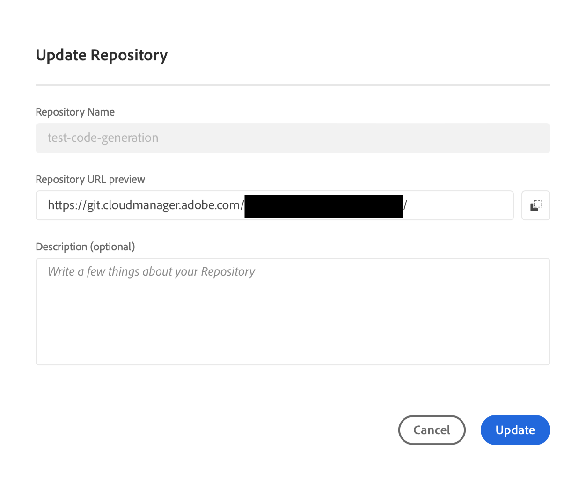

# Repositorios de Cloud Manager {#cloud-manager-repos}

Obtenga información sobre cómo crear, ver y editar repositorios de Git en Cloud Manager.

## Información general {#overview}

Los repositorios se utilizan para almacenar y administrar el código del proyecto mediante Git. Cada programa que cree en Cloud Manager tiene un repositorio administrado por Adobe creado para él.

Puede elegir crear repositorios adicionales administrados por Adobe y también añadir sus propios repositorios privados. Todos los repositorios asociados con su programa se pueden ver en la ventana **Repositorios**.

Los repositorios creados en Cloud Manager también estarán disponibles para su selección al añadir o editar canalizaciones. Consulte [Canalizaciones de CI-CD](/help/overview/ci-cd-pipelines.md) para obtener más información.

Hay un único repositorio principal o una rama para una canalización determinada. Con [compatibilidad con el submódulo git](git-submodules.md), se pueden incluir muchas ramas secundarias en el momento de la compilación.

## Ventana Repositorios {#repositories-window}

1. Inicie sesión en Cloud Manager en [my.cloudmanager.adobe.com](https://my.cloudmanager.adobe.com/) y seleccione la organización y programa adecuados.

1. En la página **Información general del programa**, seleccione la pestaña **Repositorios** para pasar a la página **Repositorios**.

1. La ventana **Repositorios** muestra todos los repositorios asociados con su programa.

   

La ventana **Repositorios** proporciona detalles sobre los repositorios:

* El tipo de repositorio.
   * **Adobe** indica repositorios administrados por Adobe
   * **GitHub** indica los repositorios de GitHub que se administran
* Cuándo se creó
* Canalizaciones asociadas con el repositorio

Puede seleccionar el repositorio en la ventana y hacer clic en el botón de puntos suspensivos para realizar una acción en el repositorio seleccionado.

* **[Comprobar ramas / Crear proyecto](#check-branches)** (solo disponible para repositorios de Adobe)
* **[Copiar URL del repositorio](#copy-url)**
* **[Ver y actualizar](#view-update)**
* **[Eliminar](#delete)**

## Agregar repositorios {#adding-repositories}

Pulse o haga clic en el botón **Añadir repositorio** de la ventana **Repositorios** para iniciar el asistente **Añadir repositorio**.

Cloud Manager admite ambos repositorios administrados por Adobe (**Repositorio de Adobe**), así como sus propios repositorios autoadministrados (**Repositorio privado**). Los campos obligatorios difieren según el tipo de repositorio que decida añadir. 

Consulte [Adición de repositorios de Adobe en Cloud Manager](adobe-repositories.md).
Consulte [Adición de repositorios privados en Cloud Manager](private-repositories.md).

>[!NOTE]
>
>Un usuario debe tener la función **Administrador de implementación** o **Propietario empresarial** para poder añadir un repositorio.
>
>Hay un límite de 300 repositorios en todos los programas de cualquier compañía u organización de IMS.

## Acceder a la info del repositorio {#repo-info}

Cuando vea sus repositorios en la ventana **Repositorios**, puede ver los detalles sobre cómo acceder programáticamente a los repositorios administrados por Adobe pulsando o haciendo clic en el botón **Acceder a la info del repositorio** en la barra de herramientas.

La ventana **Información del repositorio** se abre con los detalles. Para obtener más información sobre el acceso a la información del repositorio, consulte el documento [Acceso a la información del repositorio](accessing-repositories.md).

## Comprobar ramas {#check-branches}

La acción **Comprobar ramas/Crear proyecto** realiza dos funciones según el estado del repositorio.

Si el repositorio es de nueva creación, la acción crea un proyecto de ejemplo basado en [el tipo de archivo del proyecto de AEM](https://experienceleague.adobe.com/es/docs/experience-manager-core-components/using/developing/archetype/overview).

Si al repositorio ya se le ha creado el proyecto de muestra, compruebe el estado del repositorio y sus ramas e informes de nuevo si el proyecto de muestra ya existe.

## Copiar la URL del repositorio {#copy-url}

La acción **Copiar la URL del repositorio** copia la URL del repositorio seleccionado en la ventana **Repositorios** en el portapapeles para utilizarla en otra parte.

## Ver y actualizar {#view-update}

La acción **Ver y actualizar** abre el cuadro de diálogo **Actualizar repositorio**. Con esta acción puede ver el **Nombre** y la **Vista previa de la URL del repositorio**, así como actualizar la **Descripción** del repositorio.

## Eliminar {#delete}

La acción **Eliminar** elimina el repositorio del proyecto. Un repositorio no se puede eliminar si está asociado con una canalización.

Cuando se elimina un repositorio en Cloud Manager, se marca como eliminado; ya no es accesible para el usuario. Sin embargo, se mantiene en el sistema con fines de recuperación.

Si intenta crear un repositorio nuevo después de eliminar uno con el mismo nombre, recibirá el mensaje de error `An error has occurred while trying to create repository. Contact your CSE or Adobe Support.`

Si recibe este mensaje de error, póngase en contacto con el soporte de Adobe para que le ayuden a cambiar el nombre del repositorio eliminado o elija un nombre diferente para el nuevo repositorio.
