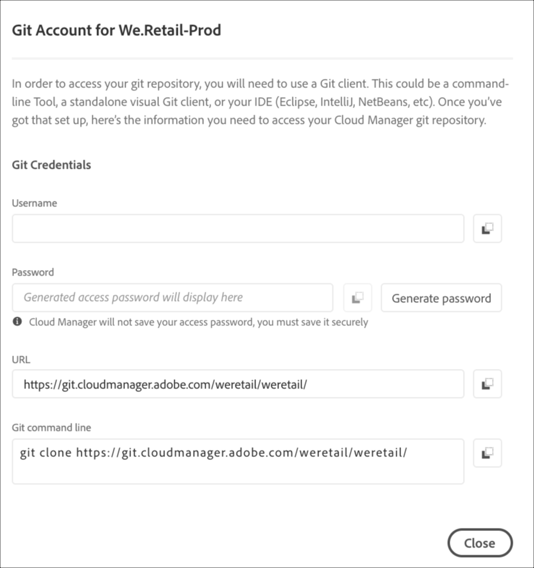

# Acceder a Git {#accessing-git}

Puede acceder a su repositorio Git y administrarlo mediante la administración de cuentas Git de autoservicio desde la interfaz de usuario de Cloud Manager.

## Uso de Administración de cuentas de Git de autoservicio {#self-service-git}

Utilice el botón **Administrar Git** disponible en la interfaz de usuario de Cloud Manager, especialmente en la tarjeta de canalización.

1. Vaya a la página *Program&#39;s Overview* y a la tarjeta Canalizaciones .

1. Verá la opción **Administrar Git** para acceder y administrar su repositorio Git.

   

   Además, si selecciona la pestaña **Non-Production** canalización, también verá la opción **Manage Git**.

   

>[!NOTE]
>
>La opción **Administrar Git** es visible para los usuarios en la función Desarrollador o Administrador de implementación. Al hacer clic en este botón, se abre un cuadro de diálogo que permite al usuario encontrar la URL de su repositorio Git de Cloud Manager junto con su nombre de usuario y contraseña.

