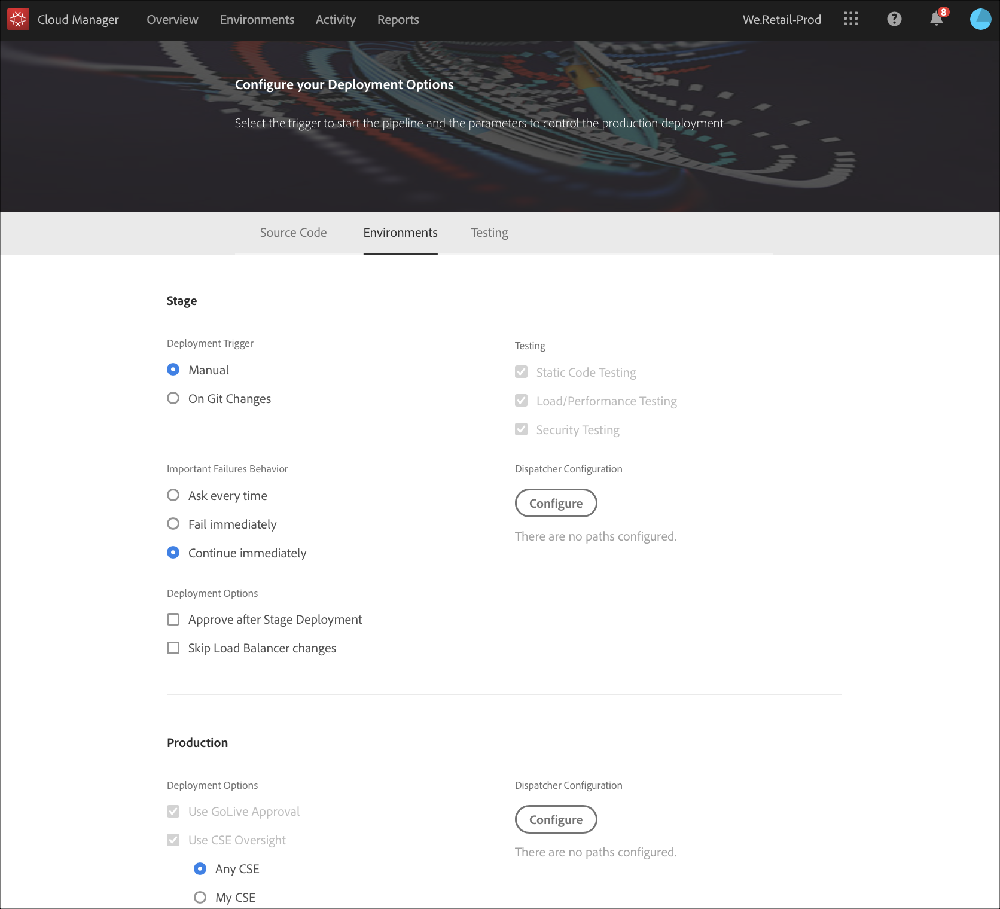

# Configurar la canalización de CD/CI {#configure-your-ci-cd-pipeline}

En la página siguiente se explica cómo configurar la **canalización**. Para obtener más información conceptual sobre el funcionamiento de la canalización, consulte la descripción general [de la canalización](ci-cd-pipeline.md)CI/CD.

## Tutorial de vídeo {#video-tutorial-one}

### Configuración de la canalización en el Administrador de nube {#config-pipeline-video}

La configuración de la tubería de producción CI/CD define el activador que iniciará la canalización, parámetros que controlan la implementación de producción y parámetros de prueba de rendimiento.

>[!VIDEO](https://video.tv.adobe.com/v/26314/)

## Explicación del flujo {#understanding-the-flow}

Puede configurar la canalización desde el mosaico **Configuración de canalización** en la interfaz de usuario de [!UICONTROL Cloud Manager].

El Administrador de implementación es responsable de configurar la canalización. Al hacerlo, primero se selecciona una rama del **repositorio** Git. La configuración de canalización consiste en:

* definir el activador que va a inicio de la canalización.
* definir los parámetros que controlan la implementación de producción.
* configuración de los parámetros de prueba de rendimiento.

## Configuración de la canalización {#setting-up-the-pipeline}

>[!CAUTION]
>
>La canalización no se puede configurar hasta que el repositorio Git tenga al menos una ramificación y se complete la configuración [de](setting-up-program.md) Programa.

Para poder implementar el código con inicio, debe configurar la configuración de la canalización desde el [!UICONTROL Cloud Manager].

>[!NOTE]
>
>Puede cambiar la configuración de la canalización después de la configuración inicial.

### Configuración de la canalización desde [!UICONTROL Cloud Manager] {#configuring-the-pipeline-settings-from-cloud-manager}

Una vez que haya configurado el programa mediante [!UICONTROL Cloud Manager] la interfaz de usuario, estará listo para configurar la canalización.

Siga estos pasos para configurar el comportamiento y las preferencias de la canalización:

1. Haga clic en **Configurar tubería** para configurar y configurar la canalización.

   

1. Aparece la pantalla **Configurar tubería** .

   El asistente de tres pasos le permite configurar el entorno de **ramas**, **Entornos** y **pruebas** .
Seleccione la rama Git y haga clic en **Siguiente**.

   >[!NOTE]
   >
   >Las ramas que se encuentran en el repositorio de Git están vinculadas a su programa.

   

1. Acceda a la ficha **Entornos** para seleccionar las opciones **Fase** y **Producción** .

   Puede definir el activador para el inicio de la canalización:

   * **Al cambiar** Git: inicio la canalización CI/CD cada vez que se añaden confirmaciones a la rama git configurada. Incluso si selecciona esta opción, siempre puede realizar el inicio de la canalización manualmente.
   * **Manual** : el uso de la interfaz de usuario inicio manualmente la canalización.

   Durante la configuración o edición de la canalización, el Administrador de implementación tiene la opción de definir el comportamiento de la canalización cuando se produce un error importante en cualquiera de las compuertas de calidad, como Calidad del código, Pruebas de seguridad y Pruebas de rendimiento.

   Esto resulta útil para los clientes que desean procesos más automatizados. Las opciones disponibles son:

* **Preguntar cada vez** : Esta es la configuración predeterminada y requiere una intervención manual en caso de error importante.
* **Error inmediato** : si se selecciona, la canalización se cancelará siempre que se produzca un error importante. Esto es, esencialmente, emular a un usuario rechazando manualmente cada error.
* **Continuar inmediatamente** : si se selecciona, la canalización se realizará automáticamente cada vez que se produzca un error importante. Esto es, esencialmente, emular a un usuario aprobando manualmente cada error.

   Ahora define los parámetros que controlan la implementación de producción. Las tres opciones disponibles son las siguientes:

* **Usar aprobación** de lanzamiento: una implementación debe ser aprobada manualmente por un propietario de empresa, un jefe de proyecto o un administrador de implementación a través de la [!UICONTROL Cloud Manager] interfaz de usuario.
* **Usar la supervisión** de CSE: un CSE se compromete a realizar el inicio de la implementación. Durante la configuración o edición de la canalización cuando la supervisión de CSE está habilitada, el administrador de implementación tiene la opción de seleccionar:

   * **Cualquier CSE**: hace referencia a cualquier CSE disponible
   * **Mi CSE**: hace referencia a un CSE específico asignado al cliente o a su copia de seguridad, si el CSE está fuera de la oficina

* **Programado** : esta opción permite al usuario activar la implementación de producción programada.

>[!NOTE]
>
>Si la opción **Programado** está seleccionada, puede programar la implementación de producción en la canalización **después** de la implementación de la fase (y **usar aprobación** de GoLive, si se ha activado) para esperar a que se establezca una programación. El usuario también puede elegir ejecutar la implementación de producción inmediatamente.
>
>Consulte [**Implementar el código**](deploying-code.md), para establecer la programación de implementación o ejecutar la producción inmediatamente.

>[!NOTE]
>
>La opción **Usar supervisión** de CSE no está disponible para todos los clientes.

**Aprobar después de la implementación de la etapa**

Hay un paso opcional **Aprobar después de la implementación** de la etapa que se puede configurar en la canalización de producción.
Esta opción está habilitada en una nueva opción de la pantalla **de edición** de canalización:

A continuación, se muestra como un paso independiente durante la ejecución de la canalización:

>[!NOTE]
>
>**La aprobación después de la implementación** de la fase funciona de manera similar a la aprobación antes de la implementación de producción, pero se produce inmediatamente después del paso de implementación de la fase, es decir, antes de que se realice la prueba, en comparación con la aprobación antes de la implementación de producción, que se realiza una vez finalizadas todas las pruebas.

**Invalidación del despachante**

Como administrador de implementación, tiene la oportunidad de configurar un conjunto de rutas de contenido que se **invalidarán** o se **vaciarán** de la caché de AEM Dispatcher para instancias de publicación, mientras se configura o se edita la canalización.

Puede configurar un conjunto independiente de rutas para la implementación de fase y producción. Si se configuran, estas acciones de caché se realizarán como parte del paso de la canalización de implementación, justo después de implementar cualquier paquete de contenido. Esta configuración utiliza el comportamiento estándar AEM Dispatcher: invalidate realiza una invalidación de caché, similar a cuando el contenido se activa de la creación a la publicación; flush realiza una eliminación de caché.

En general, es preferible el uso de la acción de invalidación, pero puede haber casos en los que sea necesario vaciar, especialmente cuando se utilizan AEM bibliotecas cliente HTML.

>[!NOTE]
>
>Consulte [Información general](dispatcher-configurations.md) de Dispatcher para obtener más información sobre el almacenamiento en caché de Dispatcher.

Siga los pasos a continuación para configurar las validaciones de Dispatcher:

1. Haga clic en **Configurar** en el encabezado Configuración del despachante

   

1. Introduzca la ruta, seleccione la acción en **Tipo** y haga clic en **Añadir**. Puede especificar hasta 100 rutas por entorno. Una vez que haya agregado las rutas, haga clic en **Aplicar**.

   

1. Una vez que vuelva a la página Configuración **de** tubería, verá un resumen actualizado de las selecciones.

   Haga clic en **Guardar** para mantener esta configuración.

   

1. Acceda a la ficha **Pruebas** para definir los criterios de prueba del programa.

   Ahora puede configurar los parámetros de prueba de rendimiento.

   Puede configurar las pruebas de rendimiento de *AEM Sites* y *AEM Assets* , en función de los productos con licencia.

   **AEM Sites:**

   Cloud Manager ejecuta pruebas de rendimiento para programas de AEM Sites solicitando páginas (como usuario no autenticado de forma predeterminada) en el servidor de publicación de la fase durante un período de prueba de 30 minutos y midiendo el tiempo de respuesta para cada página, así como varias métricas a nivel del sistema.

   Antes del inicio del período de prueba de 30 minutos, Cloud Manager rastreará el entorno de la etapa utilizando un conjunto de una o más direcciones URL *iniciales* configuradas por el ingeniero de éxito del cliente. A partir de estas direcciones URL, se inspecciona el HTML de cada página y los vínculos se atraviesan de forma que tengan un ancho inicial. Este proceso de rastreo está limitado a un máximo de 5000 páginas. Las solicitudes del rastreador tienen un tiempo de espera fijo de 10 segundos.

   Las páginas se seleccionan mediante tres conjuntos **de** páginas; puede elegir entre uno y los tres conjuntos. La distribución del tráfico se basa en el número de conjuntos seleccionados, es decir, si se seleccionan los tres, el 33 % del total de vistas de página se destinan a cada conjunto; si se seleccionan dos, el 50 % se dirige a cada conjunto; si se selecciona uno, el 100 % del tráfico se dirige a ese conjunto.

   Por ejemplo: supongamos que hay una división del 50 %/50 % entre el conjunto Páginas en vivo populares y Páginas nuevas (en este ejemplo, no se utiliza Otras páginas en vivo) y que el conjunto Páginas nuevas contiene 3000 páginas. El KPI de vistas de página por minuto se establece en 200. Durante el período de prueba de 30 minutos:

   * Cada una de las 25 páginas del conjunto de páginas en vivo populares se visita 240 veces - (200 * 0.5) / 25) * 30 = 120

   * Cada una de las 3000 páginas del conjunto Nuevas páginas se visita una vez - (200 * 0.5) / 3000) * 30 = 1

   

   Consulte Prueba [de rendimiento](#authenticated-performance-testing) autenticada para obtener más detalles.

   **AEM Assets:**

   Cloud Manager ejecuta pruebas de rendimiento para programas de AEM Assets cargando los recursos repetidamente durante un período de prueba de 30 minutos y midiendo el tiempo de procesamiento de cada recurso, así como varias métricas a nivel de sistema. Esta función puede cargar imágenes y documentos PDF. La distribución de cuántos recursos de cada tipo se cargan por minuto se establece en la pantalla de configuración de tubería o de edición.

   Por ejemplo, si se utiliza una división 70/30, como se muestra en la figura siguiente. Hay 10 recursos cargados por minuto, 7 imágenes cargadas por minuto y 3 documentos.

   

   >[!NOTE]
   >
   >Hay una imagen y un documento PDF predeterminados, pero en la mayoría de los casos, los clientes querrán cargar sus propios recursos. Esto se puede realizar desde la pantalla Ajustes de tubería o Editar. Los formatos de imagen comunes como JPEG, PNG, GIF y BMP son compatibles con archivos Photoshop, Illustrator y Postscript.

1. Haga clic en **Guardar** para completar la configuración del proceso de canalización.

   >[!NOTE]
   >
   >Además, una vez que haya configurado la canalización, podrá editar la configuración de la misma mediante el mosaico Ajustes **de** tubería de producción de la [!UICONTROL Cloud Manager] interfaz de usuario.

   

### Prueba de rendimiento autenticada {#authenticated-performance-testing}

Los clientes de AMS con sitios autenticados pueden especificar un nombre de usuario y una contraseña que Cloud Manager utilizará para acceder al sitio web durante la prueba de rendimiento del sitio.

El nombre de usuario y la contraseña se especifican como [Variables](/help/using/build-environment-details.md#pipeline-variables) de canalización con los nombres `CM_PERF_TEST_BASIC_USERNAME` y `CM_PERF_TEST_BASIC_PASSWORD`.

Aunque no es estrictamente necesario, se recomienda utilizar el tipo de variable de cadena para el nombre de usuario y el tipo de variable secretString para la contraseña. Si se especifican ambas, todas las solicitudes del rastreador de prueba de rendimiento y los usuarios virtuales de prueba contendrán estas credenciales como autenticación HTTP Basic.

Para configurar estas variables mediante la CLI [de](https://github.com/adobe/aio-cli-plugin-cloudmanager)Cloud Manager, ejecute:

`$ aio cloudmanager:set-pipeline-variables <pipeline id> --variable CM_PERF_TEST_BASIC_USERNAME <username> --secret CM_PERF_TEST_BASIC_PASSWORD <password>`

## Tuberías de calidad de código y de no producción

Además de la tubería principal que se despliega en el escenario y la producción, los clientes pueden establecer oleoductos adicionales, denominados **oleoductos** no productivos. Estas tuberías siempre ejecutan los pasos de generación y calidad del código. Opcionalmente, también pueden implementarse en Adobe Managed Services entorno.

## Tutorial de vídeo {#video-tutorial-two}

### Canalizaciones de calidad de código y no producción de Cloud Manager {#non-prod-video}

Las tuberías de CI/CD que no son de producción se dividen en dos categorías: tuberías de calidad de código y tuberías de implementación. La calidad del código canaliza todo el código desde una rama Git para crear y evaluarse en función del análisis de calidad del código del Administrador de nube.

>[!VIDEO](https://video.tv.adobe.com/v/26316/)

En la pantalla de inicio, estos oleoductos se muestran en una tarjeta nueva:

1. Acceda al mosaico de **las tuberías** que no son de producción desde la pantalla de inicio del Administrador de nube.

   

1. Haga clic en el botón Añadir para especificar el nombre de la canalización, el tipo de canalización y la rama de Git.

   Además, también puede configurar Activador de implementación y Comportamiento de error importante desde Opciones de tubería.

   

1. Haga clic en **Guardar** y la canalización se mostrará en la tarjeta en la pantalla de inicio con tres acciones:

   * **Editar** : permite editar la configuración de la canalización
   * **Detalle** : muestra la última ejecución de la canalización (si existe)
   * **Generar** : se desplaza a la página de ejecución, desde donde se puede ejecutar la canalización

   

   >[!NOTE]
   >
   >Mientras se está ejecutando la canalización, se muestra el paso actual y solo está disponible la acción **Detalles** .

## Pasos siguientes {#the-next-steps}

Una vez configurada la canalización, debe implementar el código.

Consulte [Implementación de código](deploying-code.md) para obtener más información.
