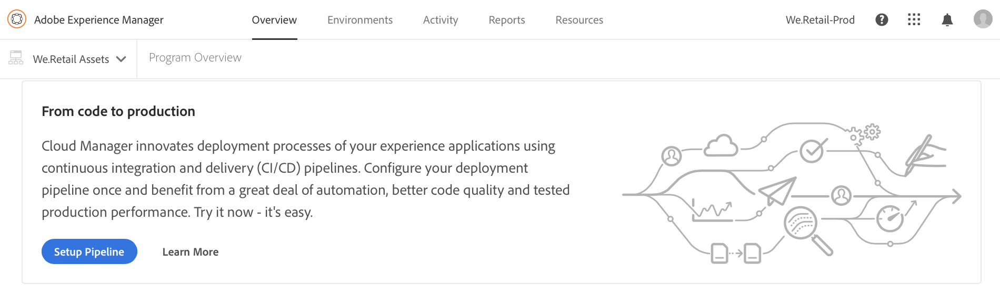
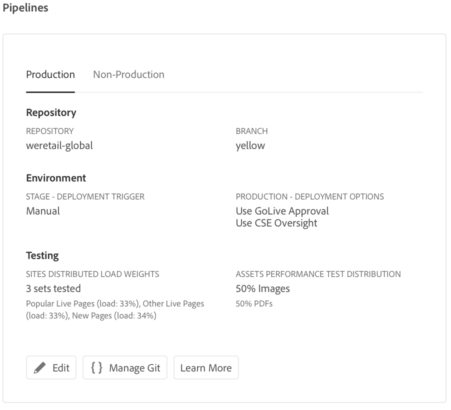
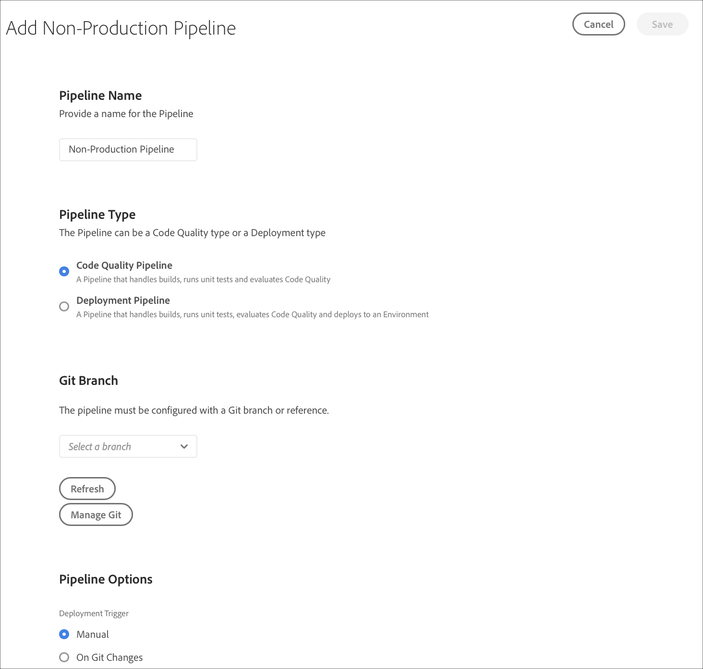

# Configurar la canalización de CD/CI {#configure-your-ci-cd-pipeline}

La siguiente página explica cómo configurar la **Canalización**. Para obtener más información conceptual sobre el funcionamiento de la canalización, consulte [CI/CD pipeline overview](ci-cd-pipeline.md).

## Tutorial de vídeo {#video-tutorial-one}

### Configuración de canalización en Cloud Manager {#config-pipeline-video}

La configuración de la canalización de producción CI/CD define el déclencheur que iniciará la canalización, parámetros que controlan la implementación de producción y parámetros de prueba de rendimiento.

>[!VIDEO](https://video.tv.adobe.com/v/26314/)

## Explicación del flujo {#understanding-the-flow}

Puede configurar la canalización desde el mosaico **Configuración de canalización** en la interfaz de usuario de [!UICONTROL Cloud Manager].

El administrador de implementación es responsable de configurar la canalización. Al hacerlo, primero se selecciona una rama del **Repositorio Git**. La configuración de canalización consta de:

* definición del déclencheur que iniciará la canalización.
* definición de los parámetros que controlan la implementación de producción.
* configuración de los parámetros de prueba de rendimiento.

## Configuración de la canalización {#setting-up-the-pipeline}

>[!CAUTION]
>
>La canalización no se puede configurar hasta que el repositorio de Git tenga al menos una rama y [Program Setup](setting-up-program.md) se haya completado.

Antes de comenzar a implementar el código, debe configurar la configuración de la canalización desde [!UICONTROL Cloud Manager].

>[!NOTE]
>
>Puede cambiar la configuración de la canalización después de la configuración inicial.

### Configuración de la canalización desde [!UICONTROL Cloud Manager] {#configuring-the-pipeline-settings-from-cloud-manager}

Una vez que haya configurado el programa utilizando la interfaz de usuario [!UICONTROL Cloud Manager], estará listo para configurar la canalización.

Siga estos pasos para configurar el comportamiento y las preferencias de la canalización:

1. Haga clic en **Configuración de canalización** para configurar la canalización.

   

1. Aparece la pantalla **Configuración de canalización**.

   El asistente de tres pasos le permite configurar su entorno **Branch**, **Environments** y **Testing**.
Seleccione la rama de Git y haga clic en **Siguiente**.

   >[!NOTE]
   >
   >Las ramas que se encuentran en el repositorio de Git están vinculadas a su programa.

1. Acceda a la pestaña **Environments** para seleccionar las opciones **Stage** y **Production**.

   Puede definir el déclencheur para iniciar la canalización:

   * **Cambios en Git** : inicia la canalización CI/CD cada vez que se agregan confirmaciones a la rama git configurada. Incluso si selecciona esta opción, siempre puede iniciar la canalización manualmente.
   * **Manual** : al utilizar la IU, se inicia manualmente la canalización.

   Durante la configuración o edición de la canalización, el administrador de implementación tiene la opción de definir el comportamiento de la canalización cuando se encuentra un error importante en cualquiera de las puertas de calidad, como Calidad del código, Pruebas de seguridad y Pruebas de rendimiento.

   Esto resulta útil para los clientes que desean procesos más automatizados. Las opciones disponibles son:

* **Pregunte cada vez** : esta es la configuración predeterminada y requiere una intervención manual en cualquier error importante.
* **Cancelar inmediatamente** : si se selecciona, la canalización se cancelará siempre que se produzca un error importante. Básicamente, esto emula a un usuario rechazando manualmente cada error.
* **Aprobar inmediatamente** : si se selecciona, la canalización se realizará automáticamente cada vez que se produzca un error importante. Básicamente, esto está emulando a un usuario que aprueba manualmente cada error.

   Ahora define los parámetros que controlan la implementación de producción. Las tres opciones disponibles son las siguientes:

* **Usar Go Live Approval** : Una implementación debe ser aprobada manualmente por un propietario de empresa, un administrador de proyectos o un administrador de implementación a través de la  [!UICONTROL Cloud Manager] interfaz de usuario.
* **Usar la supervisión de CSE** : un CSE se compromete a iniciar realmente la implementación. Durante la configuración o edición de la canalización cuando la supervisión de CSE está habilitada, el administrador de implementación tiene la opción de seleccionar:

   * **Cualquier CSE**: hace referencia a cualquier CSE disponible
   * **Mi CSE**: hace referencia a un CSE específico asignado al cliente o a su copia de seguridad, si el CSE está fuera de la oficina

* **Programado** : esta opción permite al usuario activar la implementación de producción programada.

>[!NOTE]
>Si la opción **Programado** está seleccionada, puede programar la implementación de producción en la canalización **después** de la implementación de la fase (y **Utilizar aprobación de GoLive**, si se ha habilitado) para esperar a que se establezca una programación. El usuario también puede elegir ejecutar la implementación de producción inmediatamente.
>
>Consulte [**Implementar el código**](deploying-code.md) para configurar la programación de implementación o ejecutar la producción inmediatamente.

>[!NOTE]
>
>La opción **Usar supervisión de CSE** no está disponible para todos los clientes.

**Aprobar después de la implementación de la fase**

Hay un paso opcional **Aprobar después de la implementación de la fase** que se puede configurar en la canalización de producción.
Esto se habilita en una nueva opción de la pantalla **Edición de canalización**:

A continuación, se muestra como un paso independiente durante la ejecución de la canalización:

>[!NOTE]
>
>**La aprobación después de la** implementación de la fase funciona de forma similar a la aprobación antes de la implementación de producción, pero se produce inmediatamente después del paso de implementación de la fase, es decir, antes de que se realice la prueba, en comparación con la aprobación antes de la implementación de producción, que se realiza después de completar todas las pruebas.

**Invalidación de Dispatcher**

Como administrador de implementación, tiene la oportunidad de configurar un conjunto de rutas de contenido que serán **invalidadas** o **vaciadas** desde la caché de Dispatcher AEM para instancias de publicación, mientras se configura o edita la canalización.

Puede configurar un conjunto independiente de rutas para la implementación de fase y producción. Si se configura, estas acciones de caché se realizarán como parte del paso de canalización de implementación, justo después de implementar cualquier paquete de contenido. Estas configuraciones utilizan AEM comportamiento estándar de Dispatcher: invalidate realiza una invalidación de caché, similar a cuando el contenido se activa de autor a publicación; flush realiza una eliminación de caché.

En general, es preferible el uso de la acción de invalidación, pero puede haber casos en los que sea necesario vaciar, especialmente cuando se utilizan AEM bibliotecas de cliente HTML.

>[!NOTE]
>
>Consulte [Información general de Dispatcher](dispatcher-configurations.md) para obtener más información sobre el almacenamiento en caché de Dispatcher.

Siga los pasos a continuación para configurar las invalidaciones de Dispatcher:

1. Haga clic **Configurar** en el encabezado Configuración de Dispatcher

   

1. Introduzca la ruta, seleccione la acción en **Type** y haga clic en **Add**. Puede especificar hasta 100 rutas por entorno. Una vez agregadas las rutas, haga clic en **Aplicar**.

   

1. Una vez que vuelva a la página **Configuración de canalización**, verá un resumen actualizado de las selecciones.

   Haga clic en **Guardar** para mantener esta configuración.

   

1. Acceda a la pestaña **Testing** para definir los criterios de prueba del programa. Ahora puede configurar los parámetros de prueba de rendimiento.

   Puede configurar las *Pruebas de rendimiento de AEM Sites* y *AEM Assets* en función de los productos con licencia. Consulte [Pruebas de rendimiento](understand-your-test-results.md#performance-testing) para obtener más información.

1. Haga clic en **Save** para completar la configuración del proceso de canalización.

   >[!NOTE]
   >Además, una vez configurada la canalización, puede seguir editando la configuración para la misma utilizando el mosaico **Configuración de canalización de producción** de la interfaz de usuario [!UICONTROL Cloud Manager].

   

## Canalizaciones de calidad de código y no producción

Además de la canalización principal que se implementa en las fases y la producción, los clientes pueden configurar canalizaciones adicionales, denominadas **Canalizaciones que no son de producción**. Estas canalizaciones siempre ejecutan los pasos de compilación y calidad del código. Opcionalmente, también pueden implementarse en el entorno de Adobe Managed Services.

## Tutorial de vídeo {#video-tutorial-two}

### Canalizaciones de calidad de código y no producción de Cloud Manager {#non-prod-video}

Las canalizaciones no productivas de CI/CD se dividen en dos categorías, las canalizaciones de calidad del código y las canalizaciones de implementación. La calidad del código canaliza todo el código de una rama de Git para crearlo y evaluarlo en relación con el análisis de calidad del código de Cloud Manager.

>[!VIDEO](https://video.tv.adobe.com/v/26316/)

En la pantalla de inicio, estas canalizaciones se enumeran en una tarjeta nueva:

1. Acceda al mosaico **Canalizaciones que no son de producción** desde la pantalla de inicio de Cloud Manager.

   

1. Haga clic en el botón Add para especificar el nombre de la canalización, el tipo de canalización y la rama Git.

   Además, también puede configurar el Déclencheur de implementación y el Comportamiento de error importante desde Opciones de canalización.

   

1. Haga clic en **Guardar** y la canalización se mostrará en la tarjeta de la pantalla principal con tres acciones:

   * **Editar** : permite editar la configuración de la canalización
   * **Detail** : muestra la última ejecución de la canalización (si existe)
   * **Generar** : navega a la página de ejecución desde la que se puede ejecutar la canalización

   

   >[!NOTE]
   >
   >Mientras se está ejecutando la canalización, se muestra el paso actual y solo está disponible la acción **Details**.

## Pasos siguientes {#the-next-steps}

Una vez configurada la canalización, debe implementar el código.

Consulte [Implementar el código](deploying-code.md) para obtener más información.
