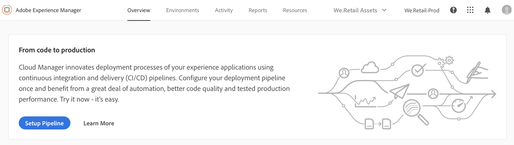
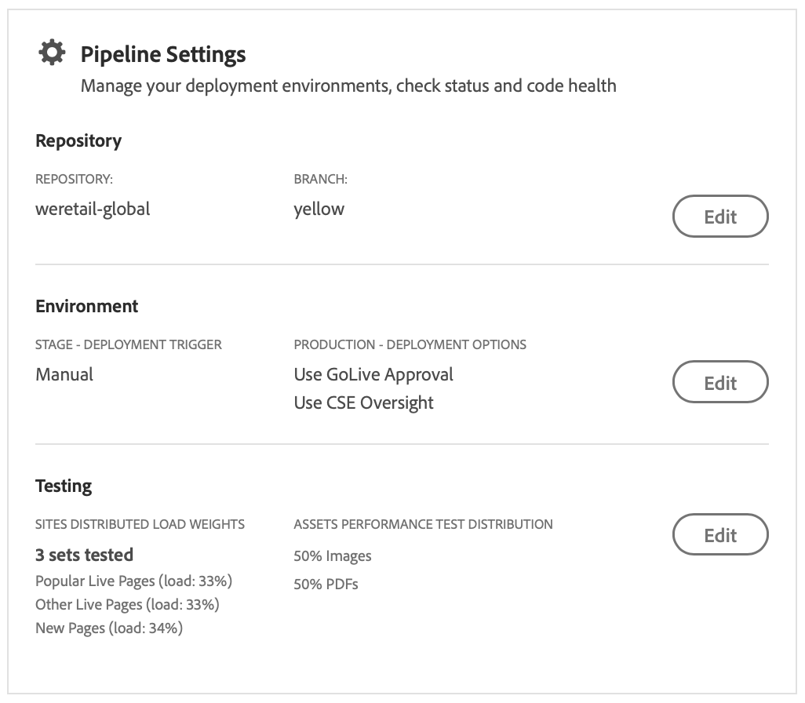
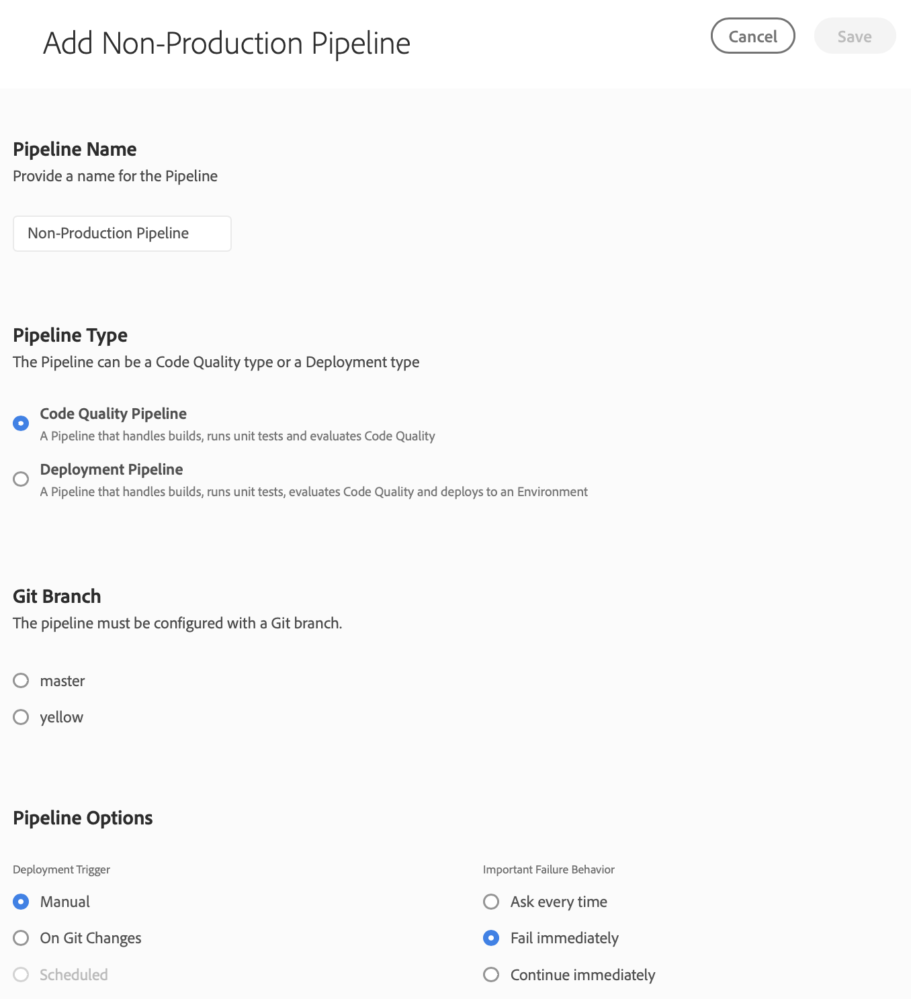

# Configurar su flujo de fuente de CD/CD {#configure-your-ci-cd-pipeline}

En la página siguiente se explica cómo configurar **Pipeline**. Para examinar más información conceptual sobre cómo funciona el canal, consulte la descripción general de la canalización [CI/CD](ci-cd-pipeline.md).

## Explicación del flujo {#understanding-the-flow}

Puede configurar su canal desde el mosaico Configuración **de pipeline en la** [!UICONTROL Cloud Manager] interfaz de usuario.

El Administrador de implementación es responsable de configurar la canalización. Al hacerlo, primero selecciona una rama del repositorio **de Git**. La configuración del canal consiste en:

* definir el activador que iniciará la canalización.
* definir los parámetros que controlan la implementación de producción.
* configurar los parámetros de prueba de rendimiento.

## Configuración del Pipeline {#setting-up-the-pipeline}

>[!CAUTION]
>
>La canalización no se puede configurar hasta que el repositorio de Git tenga al menos una ramificación y [se haya completado la Configuración](setting-up-program.md) del programa.

Antes de comenzar a implementar el código, debe configurar su configuración de canal desde [!UICONTROL Cloud Manager].

>[!NOTE]
>
>Puede cambiar la configuración del canal después de la configuración inicial.

### Configuración de la configuración de Pipeline desde [!UICONTROL Cloud Manager]{#configuring-the-pipeline-settings-from-cloud-manager}

Una vez configurado el programa mediante [!UICONTROL Cloud Manager] la interfaz de usuario, podrá configurar su portafolio.

Siga estos pasos para configurar el comportamiento y las preferencias del canal:

1. Haga clic en **Canal** de configuración para configurar y configurar su canal.

   

1. **Se abre** la pantalla Pipeline Pipeline.

   El asistente de tres pasos le permite configurar su **entorno de rama**, **entornos** y **prueba** .
Seleccione su ramificación Git y haga clic **en Siguiente**.

   >[!NOTE]
   >
   >Las ramas que se encuentran en el repositorio de Git están vinculadas al programa.

   

1. Acceda a la ficha **Entornos** para seleccionar **las opciones Etapa** y **Producción** .

   Puede definir el activador para iniciar el canal:

   * **En cambios** de git: inicia la canalización CI/CD siempre que se haya añadido a la ramificación de git configurada. Aunque seleccione esta opción, siempre puede iniciar la canalización manualmente.
   * **Manual** : con la IU se inicia manualmente la canalización.
   * **Programado** : esta opción próximamente estará disponible en una próxima versión.
   Durante la configuración o edición de canalizaciones, el Administrador de implementación tiene la opción de definir el comportamiento de la canalización cuando se encuentre un error importante en cualquiera de las puertas de calidad, como Calidad del código, Prueba de seguridad y Prueba de rendimiento.

   Esto es útil para clientes que tienen el deseo de procesos automatizados. Las opciones disponibles son:

* **Pregunte cada vez** : Esta es la configuración predeterminada y requiere intervención manual en cualquier falla importante.
* **Error de inmediato** : si se selecciona, la canalización se cancelará siempre que se produzca un error importante. Esto suele emular a un usuario para que rechace manualmente cada error.
* **Continuar inmediatamente** : Si se selecciona, la canalización continuará automáticamente cada vez que se produce un error importante. Esto suele emular a un usuario para que apruebe manualmente cada error.

   Ahora define los parámetros que controlan la implementación de producción. Las tres opciones disponibles son las siguientes:

* **Utilizar aprobación** en lanzamiento: un propietario de negocio, un administrador de proyectos o un gestor de implementación deben aprobar una implementación manualmente mediante [!UICONTROL Cloud Manager] la interfaz de usuario.
* **Usar CSE Monitoring** - A CSE is engaged to really start the deployment. Durante la configuración o edición de la canalización cuando está habilitada la supervisión CSE, el administrador de implementación tiene la opción de seleccionar:

   * **Cualquier CSE**: hace referencia a cualquier CSE disponible
   * **Mi CSE**: hace referencia a una CSE específica asignada al cliente o a su copia de seguridad, si CSE está fuera de la oficina

* **Programado** : Esta opción permite al usuario habilitar la implementación programada de producción.

>[!NOTE]
>
>Si **está seleccionada la** opción Programar, puede programar la implementación de producción en la canalización **después** de la implementación del escenario (y **utilizar la aprobación de golive**, si se ha habilitado) para esperar a que se establezca una programación. El usuario también puede ejecutar la implementación de producción inmediatamente.
>
>Consulte [**Implementar su código**](deploying-code.md), para configurar el programa de implementación o ejecutar la producción inmediatamente.

>[!NOTE]
>
>La opción **Uso de la supervisión** CSE no está disponible para todos los clientes.

**Invalidación de despachante**

Como administrador de implementación, tiene la oportunidad de configurar un conjunto de rutas que se **invalidarán** o **eliminarán** de la caché de AEM Dispatcher al configurar o editar la canalización.

Puede configurar un conjunto diferente de rutas para la implementación de etapa y producción. Si se configura, estas acciones de caché se realizarán como parte del paso de canal de implementación, justo después de que se implementen los paquetes de contenido. Esta configuración utiliza el comportamiento estándar de Dispatcher de AEM: invalidate ejecuta una invalidación de caché, similar a cuando el contenido se activa desde autor que se va a publicar; vaciar realiza una eliminación de caché.

En general, es preferible utilizar la acción invalidate, pero puede haber casos en que se requiera vaciar, especialmente al utilizar las bibliotecas HTML de AEM HTML.

>[!NOTE]
>
>Consulte la Información general [de Dispatcher](dispatcher-configurations.md) para obtener más información sobre el almacenamiento en caché de Dispatcher.

Siga los pasos a continuación para configurar las invalidaciones de Dispatcher:

1. Haga clic **en Configurar** en el encabezado Configuración del despachante

   

1. Introduzca la ruta, seleccione la acción de **Tipo** y haga clic **en Agregar**. Puede especificar hasta 100 rutas por entorno. Una vez agregadas las rutas, haga clic **en Aplicar**.

   

1. Una vez que vuelva a la **página Configuración** de canal, verá un resumen actualizado de las selecciones.

   Haga clic **en Guardar** para mantener esta configuración.

   

1. Acceda a la ficha **Pruebas** para definir los criterios de prueba del programa.

   Ahora puede configurar los parámetros de prueba de rendimiento.

   Puede configurar *las pruebas de rendimiento de AEM Sites* y *AEM Assets* , según los productos que tenga licencia.

   **AEM Sites:**

   Cloud Manager ejecuta las pruebas de rendimiento para los programas de AEM Sites al solicitar páginas (como usuario no autenticado) en el servidor de publicación del escenario durante un período de prueba de 30 minutos y medir el tiempo de respuesta para cada página, así como distintas métricas de nivel de sistema. Las páginas están seleccionadas por tres conjuntos **de páginas**; puede elegir entre uno y los tres conjuntos. La distribución del tráfico se basa en el número de conjuntos seleccionados, es decir, si se seleccionan los tres, el 33% del total de vistas de página se colocará en cada conjunto; si se seleccionan dos, el 50% va a cada conjunto; Si se selecciona uno, el 100% del tráfico va a dicho conjunto.

   Por ejemplo, supongamos que hay un 50%/50% entre las Páginas interactivas populares y las páginas nuevas (en este ejemplo no se utiliza Ninguna otra página Live Pages) y el conjunto Nuevas páginas contiene 3000 páginas. Las vistas de página por minuto KPI se establecen en 200. Durante el período de prueba de 30 minutos:

   * Cada una de las 25 páginas del conjunto Páginas activas populares se visita 240 veces (((200 * 0.5)/ 25) * 30 = 120

   * Se realizará una visita única a cada una de las 3000 páginas del conjunto de páginas nuevas (((200 * 0.5)/ 3000) * 30 = 1
   

   **AEM Assets:**

   El Administrador de nube ejecuta pruebas de rendimiento para programas de AEM Assets, cargando recursos varias veces durante un período de prueba de 30 minutos y midiendo el tiempo de procesamiento de cada recurso, así como varias métricas de nivel de sistema. Esta capacidad puede cargar imágenes y documentos PDF. La distribución de cuántos recursos de cada tipo se carga por minuto se configura en la pantalla de configuración de Pipeline o Editar.

   Por ejemplo, si se utiliza una división del 70/30, como se ve en la siguiente figura. Hay 10 recursos cargados por minuto, 7 imágenes se cargarán por minuto y 3 documentos.

   

   >[!NOTE]
   >
   >Existe una imagen predeterminada y un documento PDF, pero en la mayoría de los casos los clientes desean cargar sus propios recursos. Esto se puede realizar desde la pantalla Configuración de Pipeline o Editar. Se admiten formatos de imagen comunes como JPEG, PNG, GIF y BMP junto con archivos Photoshop, Illustrator y Postscript.

1. Haga clic **en Guardar** para completar la configuración del proceso de canalización.

   >[!NOTE]
   >
   >Además, una vez configurado el canal, podrá seguir editando los ajustes de la misma opción utilizando **el mosaico Configuración** de pipeline de la interfaz de [!UICONTROL Cloud Manager] usuario.

   

## Canales de no producción y de calidad del código solo

Además de la canalización principal que se implementa en etapa y producción, los clientes pueden configurar canales adicionales, denominados canales **no de producción**. Estos pipeline siempre ejecutan los pasos de la calidad de diseño y código. También pueden implementar en el entorno de Servicios gestionados de Adobe.

En la pantalla principal, estos pipeline aparecen en una tarjeta nueva:

1. Acceda al **mosaico de No producción desde** la pantalla de inicio de Cloud Manager.

   

1. Haga clic en el botón Agregar para especificar el Nombre de Pipeline, Tipo de pipeline y Rama de Git.

   Además, puede configurar el activador de implementación y el comportamiento de errores importantes de las opciones de Pipeline.

   

1. Haga clic **en Guardar** y la canalización se muestra en la tarjeta en la pantalla principal con tres acciones:

   * **Editar** : permite editar la configuración del canal
   * **Detalle** : muestra la ejecución del último canal (si hay uno)
   * **Generar** : navega a la página de ejecución, desde la que se puede ejecutar la canalización
   

   >[!NOTE]
   >
   >Mientras se ejecuta la canalización, se muestra el paso actual y solo está disponible **la** acción Detalles.

## Pasos siguientes {#the-next-steps}

Una vez configurado el canal, debe implementar su código.

Consulte [Implementar el código](deploying-code.md) para obtener más detalles.
