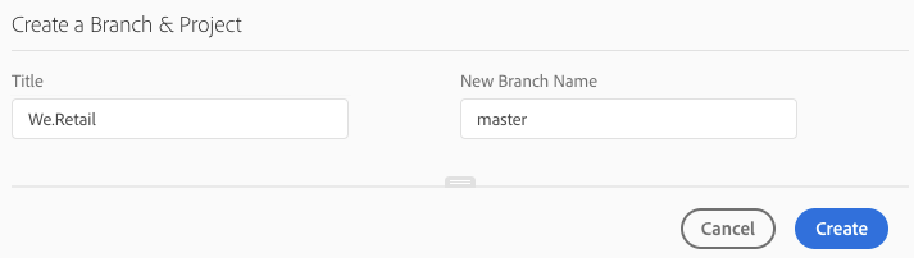

# Creación de un proyecto de aplicación AEM {#create-an-aem-application-project}

## Uso del asistente para crear un proyecto de aplicación AEM {#using-wizard-to-create-an-aem-application-project}

Cuando los clientes están conectados a Cloud Manager, se les proporciona un repositorio de git vacío. Los actuales clientes de Adobe Managed Services (AMS) (o clientes in situ que estén migrando a AMS) generalmente ya dispondrán de su código de proyecto en git (u otro sistema de control de versiones) e importarán su proyecto al repositorio git de Cloud Manager. Sin embargo, los nuevos clientes no tienen proyectos existentes.

Para ayudarle a empezar a utilizar nuevos clientes, Cloud Manager ahora puede crear un proyecto de AEM mínimo como punto de partida. Este proceso se basa en [**el tipo de archetype del proyecto de AEM**](https://github.com/Adobe-Marketing-Cloud/aem-project-archetype).

<!-- 

Comment Type: annotation
Last Modified By: jsyal
Last Modified Date: 2018-10-08T12:52:50.071-0400

2018.8.0: Added this new section

 -->

Siga los pasos a continuación para crear un proyecto de aplicación AEM en Cloud Manager:

1. Una vez que inicie sesión en Cloud Manager y se complete la configuración básica del programa, aparecerá una llamada especial a la tarjeta de acción en la pantalla **Información general** , si el repositorio está vacío.

   

1. Haga clic **en Crear** para navegar hasta la pantalla **Configuración** de Pipeline.

   

1. Haga clic **en Crear para** abrir un cuadro de diálogo, que permite al usuario proporcionar los parámetros requeridos por el tipo de archetype del proyecto AEM. En el formulario predeterminado, el cuadro de diálogo solicita dos valores:

   * **Título** : de forma predeterminada se establece en el nombre *del programa*

   * **Nuevo nombre** de rama: de forma predeterminada, es *maestro*
   

   El cuadro de diálogo tiene un cajón que se puede abrir haciendo clic en el indicador hacia la parte inferior del cuadro de diálogo. En el formulario ampliado, el cuadro de diálogo muestra todos los parámetros de configuración para el tipo de archetype. Muchos de estos parámetros tienen valores predeterminados generados en función **del Título**.

   

   >[!NOTE]
   >
   >Por ejemplo, si **el Título** es ***We. Finance***, el parámetro Base Maven Artifact Id se genera como ***com. wefinance***. Si lo desea, estos valores se pueden cambiar.
   >
   >
   >Por ejemplo, puede cambiar del valor generado ***com. wefinance*** a ***net. wefinance***.

1. Haga clic **en Crear** en el paso anterior para crear el proyecto de inicio empleando el arquetipo y transferir a la ramificación git designada. Una vez que esto ocurra, puede configurar la canalización.

## Configuración del proyecto {#setting-up-your-project}

### Modificación de los detalles de configuración del proyecto {#modifying-project-setup-details}

Para poder crear e implementar correctamente con Cloud Manager, los proyectos de AEM existentes deben atenerse a algunas reglas básicas:

* Los proyectos deben crearse con Apache Maven.
* Debe haber un *archivo pom.xml* en la raíz del repositorio Git. Este *pom.xml* archivo puede referirse a tantos submódulos (que a su vez pueden tener otros submódulos, etc.) según sea necesario.

* Puede agregar referencias a repositorios de artefactos Maven adicionales en sus *pom.xml* . Sin embargo, no se admite el acceso a repositorios de artefactos protegidos mediante contraseña o protegidos por redes.
* Los paquetes de contenido implementables se detectan buscando archivos *zip* de paquete de contenido que están contenidos en un directorio denominado *target*. Cualquier número de submódulos puede producir paquetes de contenido.

* Los defectos de distribuidor implementables se detectan buscando archivos *zip* (de nuevo, contenidos en un directorio *llamado target*) que tienen directorios llamados *conf* y *conf. d*.

* Si hay más de un paquete de contenido, no se garantiza el orden de las implementaciones de paquetes. Si se necesita un orden específico, se pueden utilizar dependencias de paquetes de contenido para definir el orden.

<!-- 

Comment Type: annotation
Last Modified By: jsyal
Last Modified Date: 2018-10-08T09:20:10.106-0400

2018.8.0: added existing in the opening sentence

 -->

## Generar detalles del entorno {#build-environment-details}

Cloud Manager crea y prueba su código con un entorno de tiempo de ejecución **especializado de creación**. Este entorno tiene los atributos siguientes:

* El entorno de compilación se basa en Linux.
* Apache Maven 3.6.0 está instalado.
* La versión de Java instalada es Oracle JDK 8 u 181.
* Se han instalado algunos paquetes de sistemas adicionales que son necesarios:

   * bzip2
   * descomprimir
   * libpng
   * imagemagick
   * graphicsmagick
   * Si necesita otros paquetes, deberá solicitarlos a través de los ingenieros de éxito de clientes (CSE).

* Maven siempre se ejecuta con el comando: *mvn —batch-mode clean org. jacoco: jacoco-maven-plugin: prepare-agent package*
* Maven está configurado a nivel de sistema con un archivo settings.xml que incluye automáticamente el repositorio público de Adobe **Artifact** . (Consulte [Repositorio de Adobe Public Maven](https://repo.adobe.com/) para obtener más detalles).

## Activación de perfiles Maven en el Administrador de nube {#activating-maven-profiles-in-cloud-manager}

En algunos casos limitados, es posible que necesite variar el proceso de diseño ligeramente cuando se ejecuta dentro de Cloud Manager en oposición a cuando se ejecuta en estaciones de trabajo programadoras. En estos casos, [los perfiles Maven](https://maven.apache.org/guides/introduction/introduction-to-profiles.html) pueden utilizarse para definir el modo en que la compilación debe ser diferente en diferentes entornos, incluido el Administrador de nube.

La activación de un perfil Maven dentro del entorno de compilación de Cloud Manager debe realizarse buscando la presencia de una variable de entorno denominada `CM_BUILD`. Esta variable siempre se configurará dentro del entorno de compilación de Cloud Manager. Por el contrario, un perfil diseñado solo fuera del entorno de creación de Cloud Manager debe realizarse buscando el significado de esta variable.

Por ejemplo, si desea generar un mensaje simple solo cuando la compilación se ejecuta dentro de Cloud Manager, lo haría:

```xml
        <profile>
            <id>cmBuild</id>
            <activation>
                  <property>
                        <name>env.CM_BUILD</name>
                  </property>
            </activation>
            <build>
                <plugins>
                    <plugin>
                        <artifactId>maven-antrun-plugin</artifactId>
                        <version>1.8</version>
                        <executions>
                            <execution>
                                <phase>initialize</phase>
                                <configuration>
                                    <target>
                                        <echo>I'm running inside Cloud Manager!</echo>
                                    </target>
                                </configuration>
                                <goals>
                                    <goal>run</goal>
                                </goals>
                            </execution>
                        </executions>
                    </plugin>
                </plugins>
            </build>
        </profile>
```

>[!NOTE]
>
>Para probar este perfil en una estación de trabajo de desarrollador, puede activarlo en la línea de comandos (con `-PcmBuild`) o en el entorno de desarrollo integrado (IDE).

Y si desea generar un mensaje simple solo cuando la compilación se ejecuta fuera de Cloud Manager, lo haría:

```xml
        <profile>
            <id>notCMBuild</id>
            <activation>
                  <property>
                        <name>!env.CM_BUILD</name>
                  </property>
            </activation>
            <build>
                <plugins>
                    <plugin>
                        <artifactId>maven-antrun-plugin</artifactId>
                        <version>1.8</version>
                        <executions>
                            <execution>
                                <phase>initialize</phase>
                                <configuration>
                                    <target>
                                        <echo>I'm running outside Cloud Manager!</echo>
                                    </target>
                                </configuration>
                                <goals>
                                    <goal>run</goal>
                                </goals>
                            </execution>
                        </executions>
                    </plugin>
                </plugins>
            </build>
        </profile>
```

## Variables de entorno personalizado

En algunos casos, el proceso de generación de un cliente puede depender de variables de configuración específicas que serían inadecuadas para colocarse en el repositorio de git. El Administrador de nube permite que un ingeniero de éxito de cliente (CSE) configure estas variables cada cliente. Estas variables se almacenan en una ubicación de almacenamiento seguro y solo son visibles en el contenedor de compilación para el cliente específico. Los clientes que deseen utilizar esta función deben ponerse en contacto con su CSE para configurar sus variables.

Una vez configuradas, estas variables estarán disponibles como variables de entorno. Para utilizarlos como propiedades Maven, puede hacer referencia a ellos dentro del archivo pom.xml, posiblemente dentro de un perfil como se describe anteriormente:

```xml
        <profile>
            <id>cmBuild</id>
            <activation>
                  <property>
                        <name>env.CM_BUILD</name>
                  </property>
            </activation>
            <properties>
                  <my.custom.property>${env.MY_CUSTOM_PROPERTY}</my.custom.property>  
            </properties>
        </profile>
```

>[!NOTE]
>
>Los nombres de variables de entorno sólo pueden contener caracteres alfanuméricos y guiones bajos (_). Por convención, los nombres deberían estar todo en mayúsculas.

## Desarrollar su código basado en optimizaciones {#develop-your-code-based-on-best-practices}

Los equipos de ingeniería y consultoría de Adobe han desarrollado un [completo conjunto de prácticas recomendadas para desarrolladores de AEM](https://helpx.adobe.com/experience-manager/6-4/sites/developing/using/best-practices.html).
