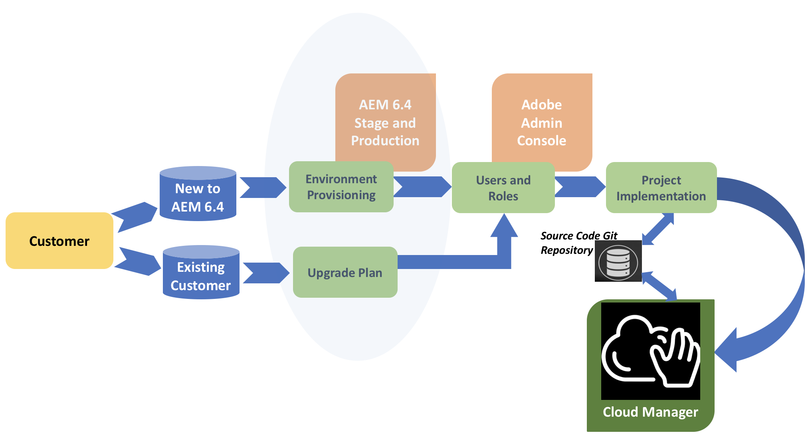

# Viaje del cliente {#customer-journey}

Como cliente, es posible que sea nuevo en Adobe Experience Manager (AEM), que actualmente utiliza AEM 6.4, o que necesite actualizar a la versión AEM 6.4 para poder utilizarla [!UICONTROL Cloud Manager]. Los siguientes escenarios explican su viaje como cliente nuevo o existente con el que comenzar [!UICONTROL Cloud Manager].

>[!NOTE]
>
>[!UICONTROL Cloud Manager] solo está disponible para los clientes de servicios gestionados de Adobe que utilicen AEM 6.4 o superior.

## Incorporación a [!UICONTROL Cloud Manager]{#on-boarding-to-cloud-manager}

1. **Nuevo cliente de AEM en los servicios gestionados de Adobe**

   Como cliente nuevo, se le incorporará [!UICONTROL Cloud Manager] como parte del proceso de integración en el servicio en la nube gestionado por Adobe.

   La dirección URL a la que se accede [!UICONTROL Cloud Manager] se incluirá en el mensaje de correo electrónico de bienvenida, junto con las instrucciones para iniciar sesión en [!UICONTROL Experience Cloud]Adobe Admin Console y usar la misma para administrar los usuarios y sus permisos respectivos, para aquellos usuarios que necesiten acceder a [!UICONTROL Cloud Manager].

1. **Cliente existente de AEM en los servicios gestionados de Adobe**

   Como cliente existente, primero deberá actualizar los entornos de producción y no producción existentes a la versión AEM 6.4. Al mismo tiempo que realizará la actualización, se le proporcionará la dirección URL para acceder [!UICONTROL Cloud Manager]. Además, deberá empezar a utilizar Adobe Admin Console para administrar los usuarios y sus permisos respectivos, para aquellos usuarios que necesiten acceder a ellos [!UICONTROL Cloud Manager].

   El proyecto de AEM existente también deberá cumplir las prácticas recomendadas, ya que comenzará a utilizarlo [!UICONTROL Cloud Manager] para implementar nuevos cambios de código en los entornos de AEM.

   Para obtener información adicional sobre las ventajas de la actualización a AEM 6.4, consulte [Actualización a AEM 6.4](https://helpx.adobe.com/experience-manager/6-4/sites/deploying/using/upgrade.html).

## Acceso [!UICONTROL Cloud Manager]{#accessing-cloud-manager}

Para obtener acceso a los entornos AEM [!UICONTROL Cloud Manager] [!UICONTROL Experience Cloud] y a sus entornos AEM, solo tiene que iniciar sesión en la página de aterrizaje, utilizar las credenciales de Adobe Identity Management y seleccionar AEM en la interfaz del conmutador de soluciones.

Tras iniciar sesión [!UICONTROL Cloud Manager] por primera vez, tendrá acceso a los entornos AEM directamente desde la [!UICONTROL Cloud Manager] interfaz de usuario. En este punto, estará listo para explorar todas las posibilidades de [!UICONTROL Cloud Manager], una vez que tenga su primera rama de código lista para ser implementada en los entornos de etapa y producción.

Para explorar y comenzar con [!UICONTROL Cloud Manager], consulte Inicio de sesión [por](first-time-login.md)primera vez. Para obtener más información sobre AEM, consulte [Introducción a AEM 6.4](https://helpx.adobe.com/experience-manager/6-4/sites/deploying/using/deploy.html). Además, consulte Recursos  AEM para obtener más información.

## Getting Started with [!UICONTROL Cloud Manager] {#getting-started-with-cloud-manager}

Una vez que haya iniciado sesión en [!UICONTROL Cloud Manager], lo primero que debe hacer será configurar el entorno de repositorio de código, luego el equipo y las funciones. En concreto, las pertenencias a funciones se asignan agregando el usuario a un [!UICONTROL Cloud Manager] perfil mediante la interfaz de usuario de la Consola de administración.

A continuación, debe configurar sus ramas de código fuente en el repositorio **** Git, definir sus objetivos en términos de KPI de carga y rendimiento y probar los escenarios para implementar correctamente su código en los entornos de etapa y producción una vez que todas las comprobaciones de calidad se hayan superado correctamente.

## Trayecto de final a final {#end-to-end-journey}

El diagrama siguiente ilustra el viaje del cliente a un nivel alto, al utilizar la canalización [!UICONTROL Cloud Manager] CI/CD para implementar los cambios de código en los entornos de etapa y producción.

