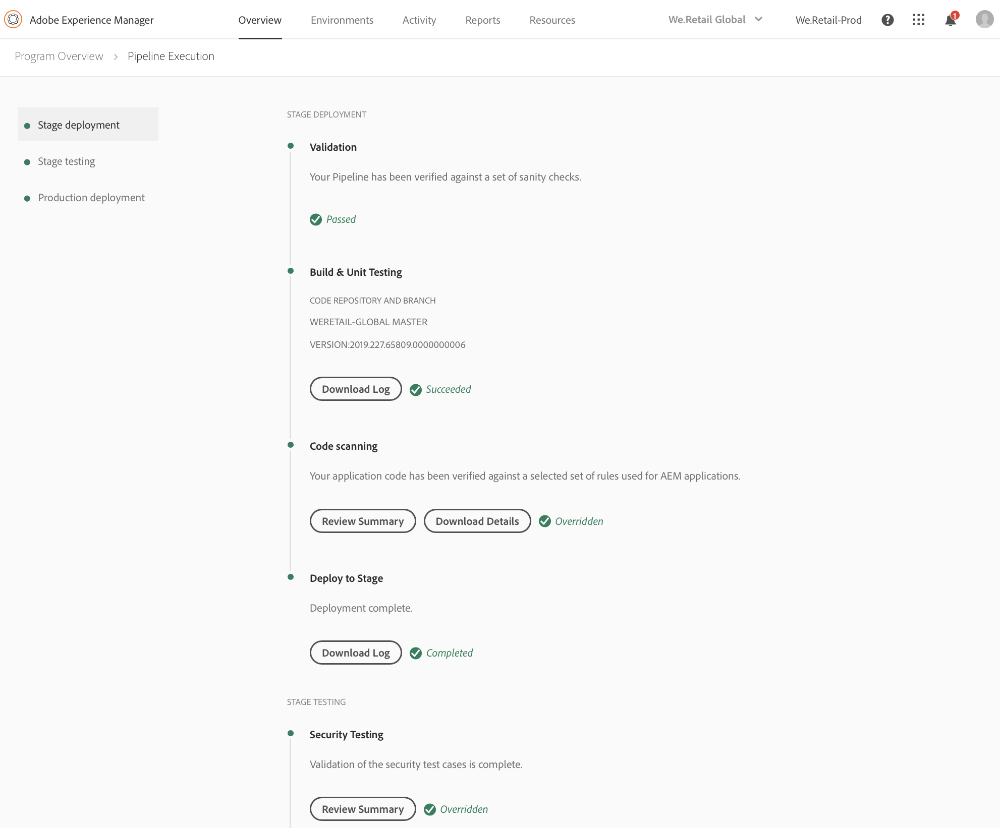

# Implementar su código {#deploy-your-code}

## Implementación de código con el administrador de nube {#deploying-code-with-cloud-manager}

Una vez configurado **el entorno de la** prueba (repositorio, entorno y prueba), podrá implementar su código.

1. Haga clic **en Implementar** desde el Administrador de nube para iniciar el proceso de implementación.

   

1. Aparece **la pantalla Ejecución** de Pipeline.

   Haga clic **en Generar** para iniciar el proceso.

   

1. El proceso completo de generación implementa el código.

   Las etapas siguientes están involucradas en el proceso de creación:

   1. Implementación del escenario
   1. Prueba de etapa
   1. Implementación de producción
   >[!NOTE]
   >
   >Además, puede revisar los pasos de varios procesos de implementación observando registros o revisar resultados para los criterios de prueba.

   La implementación **** del escenario implica los pasos siguientes:

   * Prueba de generación y unidades
   * Digitalización de código
   * Implementar en escenario
   

   La prueba **** de etapa incluye los pasos siguientes:

   * Prueba de seguridad
   * Prueba de rendimiento
   

   La implementación **** de producción implica los pasos siguientes:

   * **Solicitud para aprobación** (si está habilitada)
   * **Programar la implementación de producción** (si está habilitada)
   * **Compatibilidad con** CSE (si se habilita)
   * **Implementar en producción**
   >[!NOTE]
   >
   >**La programación Programada de producción** está habilitada mientras se configura la canalización.
   >
   >
   >Con esta opción, puede programar la salida de producción o hacer clic **en Ahora** para ejecutar la implementación de producción inmediatamente.
   >
   >
   >La fecha y hora programadas se especifican en términos de la zona horaria del usuario.
   >
   >
   >Haga clic **en Confirmar** para verificar la configuración.

   

   Una vez que confirme la programación de la implementación, se completa la implementación del código.

   Se abre la siguiente pantalla, cuando **la** opción Ahora está seleccionada en el paso anterior.

   

## Proceso de implementación {#deployment-process}

En la sección siguiente se describe cómo se implementan los paquetes de AEM y dispatcher en la fase de etapa y en la fase de producción.

Cloud Manager carga todos los archivos de destino/*.zip producidos por el proceso de compilación en una ubicación de almacenamiento. Estos artefactos se recuperan de esta ubicación durante las fases de implementación del canal.

Cuando el Administrador de nube se implementa en topologías de no producción, el objetivo es completar la implementación lo más rápido posible y, por lo tanto, los artefactos se implementan en todos los nodos de forma simultánea como se indica a continuación:

1. El Administrador de nube determina si cada artefacto es un paquete de AEM o Dispatcher.
1. El Administrador de nube elimina todos los despachantes del Equilibrador de carga para aislar el entorno durante la implementación.
1. Cada artefacto AEM se implementa en cada instancia de AEM a través de las API de Package Manager, con dependencias de paquetes que determinan el orden de implementación.

   Para obtener más información sobre cómo utilizar los paquetes para instalar nuevas funciones, transferir contenido entre instancias y realizar copias de seguridad del contenido del repositorio, consulte Cómo trabajar con paquetes.

   >[!NOTE]
   >
   >Todos los artefactos AEM se implementan tanto en el autor como en los editores. Los modos de ejecución deben aprovecharse cuando se requieran configuraciones específicas de nodos. Para obtener más información sobre cómo los modos de ejecución le permiten ajustar su instancia de AEM con un propósito específico, consulte Ejecutar modos.

1. El artefacto despachante se implementa en cada despachante de la siguiente manera:

   1. Las configuraciones actuales se realizan copias de seguridad y se copian en una ubicación temporal
   1. Todas las configuraciones se eliminan excepto los archivos inmutables. Consulte Administrar las configuraciones de Dispatcher para obtener más detalles. Esto borra los directorios para garantizar que no queden archivos huérfanos.
   1. El artefacto se extrae al directorio httpd. Los archivos inmutables no se sobrescriben. Cualquier cambio que realice en los archivos inmutables del repositorio de git se ignorará en el momento de la implementación. Estos archivos son fundamentales en el marco de Dispatcher AMS y no se pueden cambiar.
   1. Apache realiza una prueba de configuración. Si no se encuentran errores, se vuelve a cargar el servicio. Si se produce un error, se restauran las configuraciones de la copia de seguridad, el servicio se vuelve a cargar y el error se informa al Administrador de nube.
   1. Cada ruta especificada en la configuración del canal se invalida o se borra desde la caché de Dispatcher.
   >[!NOTE]
   >
   >Cloud Manager espera que el artefacto de la dispatcher contenga el conjunto de archivos completo. Todos los archivos de configuración de Dispatcher deben estar presentes en el repositorio de git. Si faltan archivos o carpetas, se producirá un error de implementación.

1. Después de la implementación exitosa de todos los paquetes de AEM y Dispatcher en todos los nodos, los despachantes se vuelven a agregar al equilibrador de carga y se completó la implementación.

### Implementación en fase de producción {#deployment-production-phase}

El proceso de implementación en las topologías de producción difiere ligeramente para minimizar el impacto en los visitantes de AEM Site.

Las implementaciones de producción suelen seguir los mismos pasos anteriores, pero de forma móvil:

1. Implemente paquetes de AEM para crearlos.
1. Detach Dispatcher 1 del equilibrador de carga.
1. Implemente paquetes AEM para publicar 1 y el paquete despachante en dispatcher 1, vaciar la caché distribuidor.
1. Coloque Dispatcher 1 nuevamente en el equilibrador de carga.
1. Una vez que dispatcher 1 vuelva a entrar en servicio, detach dispatcher 2 del equilibrador de carga.
1. Implemente paquetes AEM para publicar 2 y el paquete despachante en dispatcher 2, vaciar la caché de distribuidor.
1. Coloque Dispatcher 2 nuevamente en el equilibrador de carga.
Este proceso continúa hasta que la implementación llega a todos los editores y a los emisores de la topología.

