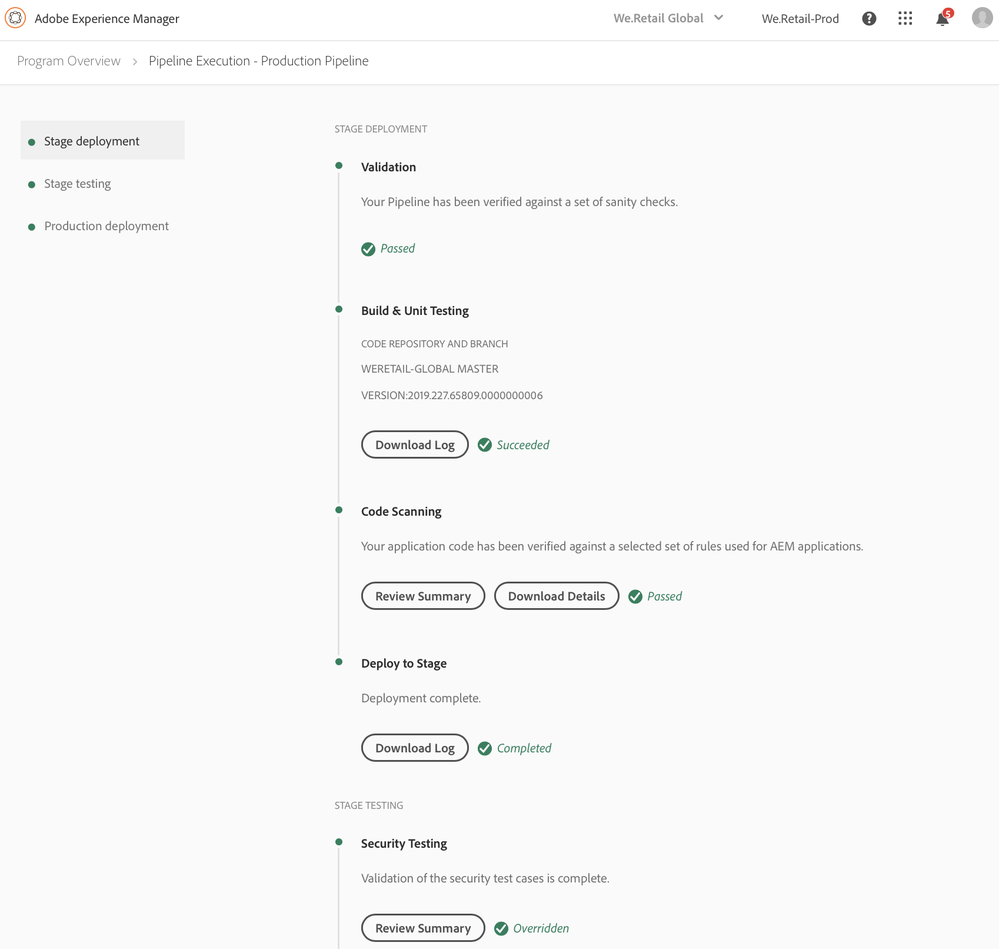
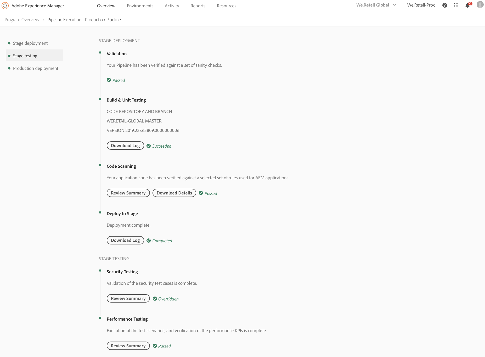

# Implementar el código {#deploy-your-code}

## Implementación de código con Cloud Manager {#deploying-code-with-cloud-manager}

Una vez configurada la tubería de producción (repositorio, entorno y entorno de prueba), estará listo para implementar el código.

1. Haga clic en **Implementar** desde el Administrador de la nube para inicio del proceso de implementación.

   

1. Aparece la pantalla **Ejecución de tubería**.

   Haga clic en **Generar** para inicio del proceso.

   

1. El proceso de compilación completa implementa el código.

   En el proceso de compilación se encuentran las siguientes etapas:

   1. Implementación de etapa
   1. Prueba de etapa
   1. Implementación de producción

   >[!NOTE]
   >
   >Además, puede revisar los pasos de varios procesos de implementación mediante la visualización de registros o la revisión de los resultados de los criterios de prueba.

   La **implementación por fases** incluye los siguientes pasos:

   * Validación: Este paso garantiza que la canalización esté configurada para utilizar los recursos disponibles actualmente, por ejemplo, que la ramificación configurada exista, que los entornos estén disponibles.
   * Prueba de generación y unidad: Este paso ejecuta un proceso de compilación en contenedores. Consulte [Explicación del Entorno de compilación](/help/using/build-environment-details.md) para obtener más información sobre el entorno de compilación.
   * Análisis de código: Este paso evalúa la calidad del código de la aplicación. Consulte [Explicación de los resultados de la prueba](understand-your-test-results.md) para obtener detalles sobre el proceso de prueba.
   * Implementar en etapa

   

   La **Prueba de etapa** incluye los siguientes pasos:

   * Prueba de seguridad: Este paso evalúa el impacto en la seguridad del código de la aplicación en el entorno de AEM. Consulte [Explicación de los resultados de la prueba](understand-your-test-results.md) para obtener detalles sobre el proceso de prueba.
   * Prueba de rendimiento: Este paso evalúa el rendimiento del código de la aplicación. Consulte [Explicación de los resultados de la prueba](understand-your-test-results.md) para obtener detalles sobre el proceso de prueba.

   

   La **Implementación de producción** incluye los siguientes pasos:

   * **Solicitud de aprobación**  (si está activada)
   * **Programar implementación**  de producción (si está habilitado)
   * **Compatibilidad**  con CSE (si está habilitada)
   * **Implementar en producción**

   

   >[!NOTE]
   >
   >La **Programar implementación de producción** está habilitada al configurar la canalización.
   >
   >
   >Con esta opción, puede programar la implementación de producción o hacer clic en **Ahora** para ejecutar la implementación de producción inmediatamente.
   >
   >
   >La fecha y la hora programadas se especifican en función de la zona horaria del usuario.
   >
   >
   >Haga clic en **Confirmar** para verificar la configuración.

   

   Una vez que confirme el programa de implementación, se completará la implementación del código.

   Se muestra la siguiente pantalla cuando se selecciona la opción **Ahora** del paso anterior.

   

## Proceso de implementación {#deployment-process}

En la siguiente sección se describe cómo se implementan los paquetes de AEM y despachantes en la fase de fase y en la fase de producción.

Cloud Manager carga todos los archivos destinatario/*.zip producidos por el proceso de compilación en una ubicación de almacenamiento.  Estos artefactos se recuperan de esta ubicación durante las fases de implementación de la canalización.

Cuando Cloud Manager se implementa en topologías que no son de producción, el objetivo es completar la implementación lo más rápido posible y, por lo tanto, los artefactos se implementan en todos los nodos simultáneamente de la siguiente manera:

1. Cloud Manager determina si cada artefacto es un paquete de AEM o de despachante.
1. Cloud Manager elimina todos los distribuidores del equilibrador de carga para aislar el entorno durante la implementación.

   A menos que se haya configurado lo contrario, puede omitir los cambios del equilibrador de carga en las implementaciones de desarrollo y de fase, es decir, desconectar y adjuntar pasos en las tuberías que no sean de producción, en los entornos de desarrollo y en la canalización de producción, para los entornos de fase.

   

   >[!NOTE]
   >
   >Se espera que esta función la utilicen principalmente los clientes 1-1-1.

1. Cada artefacto AEM se implementa en cada instancia de AEM mediante las API del administrador de paquetes, con dependencias de paquetes que determinan el orden de implementación.

   Para obtener más información sobre cómo puede utilizar los paquetes para instalar nueva funcionalidad, transferir contenido entre instancias y realizar una copia de seguridad del contenido del repositorio, consulte Cómo trabajar con paquetes.

   >[!NOTE]
   >
   >Todos los artefactos AEM se implementan tanto en el autor como en los editores. Los modos de ejecución deben aprovecharse cuando se requieran configuraciones específicas de nodos. Para obtener más información sobre cómo los modos de ejecución le permiten ajustar la instancia de AEM para un propósito específico, consulte Run Modes (Modos de ejecución).

1. El artefacto del despachante se implementa en cada distribuidor de la siguiente manera:

   1. Se realiza una copia de seguridad de las configuraciones actuales y se copian en una ubicación temporal
   1. Todas las configuraciones se eliminan excepto los archivos inmutables. Consulte Administrar las configuraciones de despachante para obtener más detalles. Esto borra los directorios para asegurarse de que no quedan archivos huérfanos.
   1. El artefacto se extrae en el directorio `httpd`.  Los archivos inmutables no se sobrescriben. Los cambios que realice en los archivos inmutables del repositorio de Git se ignorarán en el momento de la implementación.  Estos archivos son fundamentales para el marco de distribución de AMS y no se pueden cambiar.
   1. Apache realiza una prueba de configuración. Si no se encuentran errores, se vuelve a cargar el servicio. Si se produce un error, las configuraciones se restauran desde la copia de seguridad, el servicio se vuelve a cargar y el error se devuelve al Administrador de nube.
   1. Cada ruta especificada en la configuración de la canalización se invalida o se borra de la caché del despachante.

   >[!NOTE]
   >Cloud Manager espera que el artefacto del distribuidor contenga el conjunto de archivos completo.  Todos los archivos de configuración del despachante deben estar presentes en el repositorio git. Si faltan archivos o carpetas, se producirá un error en la implementación.

1. Tras la implementación correcta de todos los paquetes de AEM y despachantes en todos los nodos, los despachantes se agregan de nuevo al equilibrador de carga y la implementación se completa.

   >[!NOTE]
   >Puede omitir los cambios del equilibrador de carga en las implementaciones de desarrollo y de fase, es decir, separar y adjuntar pasos tanto en las tuberías que no son de producción, para los entornos de desarrollador y en la canalización de producción, para los entornos de fase.

### Implementación en fase de producción {#deployment-production-phase}

El proceso de implementación en topologías de producción difiere ligeramente para minimizar el impacto en los visitantes AEM sitio.

Las implementaciones de producción generalmente siguen los mismos pasos que antes, pero de manera continua:

1. Implemente AEM paquetes para crear.
1. Separe dispatcher1 del equilibrador de carga.
1. Implemente AEM paquetes para publicar1 y el paquete dispatcher para distribuir1, vacíe la caché del despachante.
1. Vuelva a colocar dispatcher1 en el equilibrador de carga.
1. Una vez que el distribuidor1 vuelva a estar en servicio, separe el distribuidor2 del equilibrador de carga.
1. Implemente AEM paquetes para publicar2 y el paquete dispatcher en dispatcher2, vacíe la caché del despachante.
1. Vuelva a colocar dispatcher2 en el equilibrador de carga.
Este proceso continúa hasta que la implementación ha llegado a todos los editores y despachantes de la topología.

