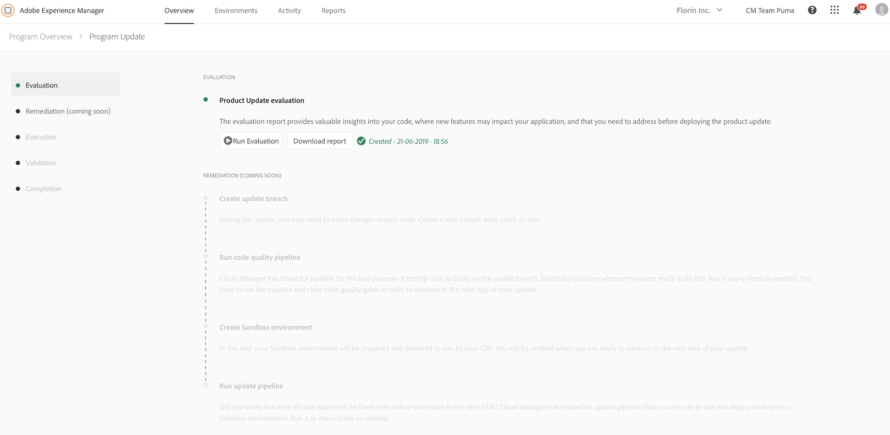

# Fase de evaluación {#evaluation}

La primera fase del asistente de actualización de productos es **[!UICONTROL Evaluation]** fase.
Aquí puede evaluar la complejidad de la actualización con el detector de patrones al que puede acceder directamente desde el asistente. Al final de este paso, tendrá acceso al informe de evaluación.

El informe generado permite comprobar la actualización de la instancia de autor detectando patrones que:

* Violar ciertas reglas y se realizan en áreas que se verán afectadas o sobrescritas por la actualización.

* Utilice una función AEM 6.x o una API que no sea compatible con versiones anteriores del nuevo AEM y que pueda romperse tras la actualización.

Esto sirve como una evaluación del esfuerzo de desarrollo que implica la actualización a Adobe Experience Manager (AEM) 6.5.

>[!NOTE]
>
>Para obtener más información sobre el detector de patrones, consulte [Evaluación de la complejidad de la actualización con el detector de patrones](https://helpx.adobe.com/experience-manager/6-4/sites/deploying/using/pattern-detector.html)

## Ejecución del evaluador {#running-evaluator}

Siga los pasos a continuación para generar un informe de evaluación:

1. Haga clic en **[!UICONTROL Run Evaluation]**.

   >[!NOTE]
   >
   >El detector de patrones puede ejecutarse en cualquier entorno. Sin embargo, para aumentar la tasa de detección y evitar cualquier desaceleración en las instancias críticas de la empresa, Cloud Manager la ejecutará en el entorno de ensayo en la instancia de creación.

   

1. El asistente le informa del estado de la acción. Cuando se genere el informe de evaluación, observará **En curso** o **completado** según corresponda.

   Una vez generado el informe, puede hacer clic en **[!UICONTROL Download report]** para guardar una copia.

   

   >[!NOTE]
   >
   >La versión actual del asistente de actualización de productos en Cloud Manager solo admite la fase de **evaluación** . Las otras cuatro fases, a saber, **Remediación**, **Ejecución**, **Validación** y **Finalización** , están llegando pronto.
