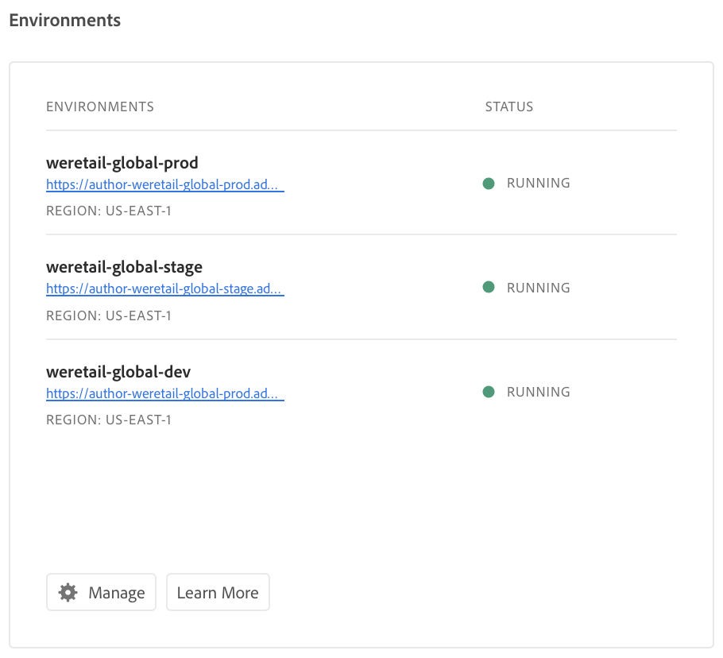
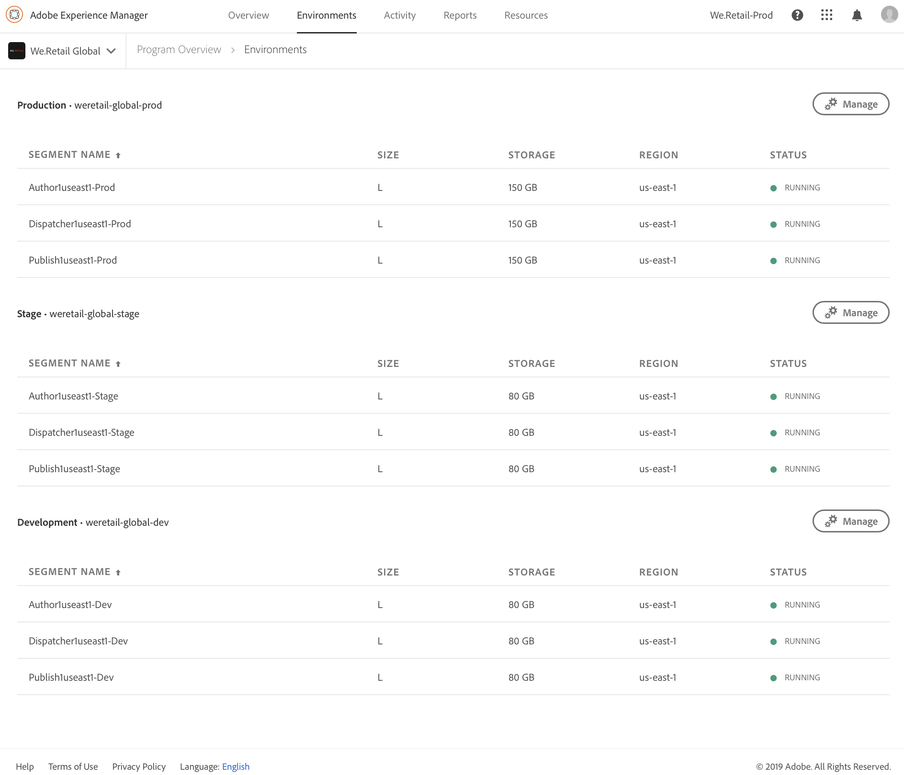

# Administrar los entornos {#manage-your-environments}

La página **Información general** de Cloud Manager incluye el mosaico **Entornos** que enumera todos los entornos de AEM administrados.

Cada uno de los entornos enumerados muestra su estado asociado.

## Tutorial de vídeo {#video-tutorial}

### Descripción general del entorno de Cloud Manager {#environ-video}

El siguiente vídeo proporciona información general sobre los entornos de Cloud Manager compuestos por instancias de AEM Author, AEM Publish y Dispatcher.

>[!VIDEO](https://video.tv.adobe.com/v/26318/)

## Acceso a los entornos en Cloud Manager {#accessing-environments-in-cloud-manager}

El mosaico **Environments** muestra los entornos de producción y fase aprovisionados en el programa junto con el estado .

El estado es el estado de alimentación resumido en los nodos del entorno. Es verde si todos los nodos se están ejecutando, rojo si incluso se detiene un nodo, azul si aparece incluso un nodo y amarillo si incluso un nodo tiene un estado de alimentación no disponible (en este orden de prioridad).

### Entornos {#environments}

Haga clic en **Administrar** para mostrar la pantalla **Entornos**.

La pantalla **Environments** muestra una tarjeta para entornos *Production* y *Stage* (según corresponda) en el programa. El nombre del entorno se muestra encima de cada tarjeta. La tarjeta incluye una tabla de nodos en el entorno junto con el tamaño de la camiseta de la cpu, el almacenamiento, la región y el estado.

>[!NOTE]
>
>El **STATUS** del nodo representa el estado de energía de la VM y no refleja el estado de AEM en el servidor. El estado puede ser **Running** (círculo verde), **Stopped** (círculo rojo), **Coming up** (círculo azul) o **Unavailable** (círculo amarillo).

