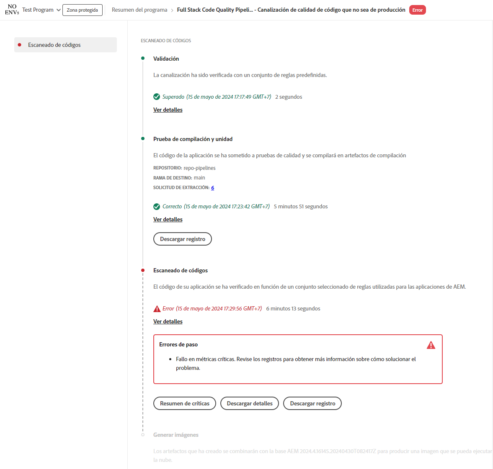

# Administrar canalizaciones {#managing-pipelines}

Aprenda a administrar las canalizaciones existentes, así como su edición, ejecución y eliminación.

## Tarjeta de canalizaciones {#pipeline-card}

La tarjeta **Canalizaciones** de la página **Información general del programa** en Cloud Manager le ofrece una descripción general de todas sus canalizaciones y de su estado actual.

Al hacer clic en el icono  junto a cada canalización, puede realizar las siguientes acciones:

* [Ejecutar la canalización](#running-pipelines). 
* [Editar la canalización](#editing-pipelines).
* [Eliminar la canalización](#deleting-pipelines).
* [Ver detalles](#view-details).

En la parte inferior de la lista de canalizaciones, tiene opciones generales.

* **Añadir**: Para añadir [una nueva canalización de producción](/help/using/production-pipelines.md) o [una nueva canalización que no sea de producción](/help/using/non-production-pipelines.md)
* **Mostrar todo**: lleva al usuario a la pantalla **Canalizaciones** para ver todas las canalizaciones en una tabla más detallada
* **Acceder a la información de repositorios**: muestra la información necesaria para acceder al repositorio de Git de Cloud Manager
* **Más información**: navega hasta los recursos de documentación de canalización de CI/CD.

## Página Canalizaciones {#pipelines}

La página **Canalizaciones** muestra una lista completa de todas las canalizaciones para el programa seleccionado. Esto resulta útil, ya que presenta información más completa que la disponible en la [Tarjeta de canalizaciones](#pipeline-card).

1. Inicie sesión en Cloud Manager en [my.cloudmanager.adobe.com](https://my.cloudmanager.adobe.com/) y seleccione la organización y programa adecuados.

1. En la página **Resumen del programa**, haga clic en **Canalizaciones** para cambiar a la página **Canalizaciones**.

1. Aquí puede ver una lista de todas las canalizaciones para el programa, así como iniciar y detener la ejecución de la canalización como lo haría en la **Tarjeta de canalizaciones**.

Al pulsar o hacer clic en el icono `i` se muestran detalles sobre la última o la actual ejecución de la canalización.

Hacer clic en **Ver detalles** le llevará a los [detalles de la ejecución de la canalización](#view-details).

### Marcar favoritos de canalización{#pipeline-favorites}

Puede marcar canalizaciones específicas como favoritas para que aparezcan en la parte superior de la lista en la página **Canalizaciones**. Esta capacidad facilita la búsqueda y ejecución de las canalizaciones a las que se accede con frecuencia.

**Para marcar favoritos de canalización:**

1. Inicie sesión en Cloud Manager en [my.cloudmanager.adobe.com](https://my.cloudmanager.adobe.com/) y seleccione la organización y programa adecuados.
1. En la página **Resumen del programa**, haga clic en  **Pestaña Canalizaciones**.
1. En la página **Canalizaciones**, a la izquierda del nombre y tipo de una canalización, haga clic en  para agregarla a su lista de favoritos.
También puede hacer clic en  para quitar la canalización de su lista de favoritos.

## Página Actividad {#activity}

La página **Actividades** muestra una lista completa de todas las ejecuciones de canalizaciones para el programa seleccionado.

1. Inicie sesión en Cloud Manager en [my.cloudmanager.adobe.com](https://my.cloudmanager.adobe.com/) y seleccione la organización y programa adecuados.

1. En la página **Resumen del programa**, haga clic en la pestaña **Actividad** para cambiar a la página **Actividad**.

1. Aquí puede ver una lista de todas las ejecuciones de canalización del programa, incluidas las ejecuciones actuales e históricas.

Al hacer clic en el icono `i` se muestran los detalles sobre la ejecución de la canalización seleccionada.

Hacer clic en **Ver detalles** le llevará a los [detalles de la ejecución de la canalización](#view-details).

## Ejecutar una canalización {#run-one-pipeline}

1. Inicie sesión en Cloud Manager en [my.cloudmanager.adobe.com](https://my.cloudmanager.adobe.com/) y seleccione la organización y programa adecuados.
1. Vaya a la tarjeta **Canalizaciones** de la página **Información general del programa**.
1. Haga clic en el icono  junto a la canalización que ejecuta y, a continuación, haga clic en **Ejecutar**.

   La columna Estado indica cuándo comienza la ejecución de la canalización.

   Para ver los detalles de la ejecución, vuelva a hacer clic en  y haga clic en **[Ver detalles](#view-details)**.

   Según el tipo de canalización, es posible que pueda cancelar la ejecución si hace clic en  de nuevo y hace clic en **Cancelar**.

## Ejecutar varias canalizaciones {#run-multiple-pipelines}

Con Cloud Manager puede ejecutar varias canalizaciones simultáneamente, lo que mejora la eficacia de la implementación para los clientes de Adobe Managed Services (AMS). La función **Ejecutar selección** le permite seleccionar varias canalizaciones y almacenarlas en déclencheur para ejecutarlas a la vez. Reduce el esfuerzo manual de tener que ejecutar las canalizaciones individualmente y optimiza los flujos de trabajo de compilación e implementación.

**Para ejecutar varias canalizaciones:**

1. Inicie sesión en Cloud Manager en [my.cloudmanager.adobe.com](https://my.cloudmanager.adobe.com/) y seleccione la organización y programa adecuados.
1. En el menú del lado izquierdo, haga clic en  **Canalizaciones**.
1. En la tabla de la página **Canalización**, active las casillas de verificación situadas junto a las canalizaciones que desee ejecutar.
Si es necesario, haga clic en el icono  **Filtros** para ordenar las canalizaciones por nombre, o entorno, o tipo de código implementado, o una combinación de los tres.
1. Cerca de la esquina superior derecha de la página, haga clic en **Ejecutar selección (x)**.
1. En el cuadro de diálogo **Ejecutar canalizaciones seleccionadas (x)**, haga clic en **Ejecutar (x)**.

   El botón **Ejecutar** refleja el número de canalizaciones que pueden continuar. Por ejemplo, puede que haya seleccionado cuatro canalizaciones, pero una ya se está ejecutando. O bien, ya no existe un entorno vinculado a una canalización seleccionada. En estos casos, el sistema se ajusta en consecuencia. El botón se actualiza a &quot;Ejecutar (3)&quot; para indicar que pueden continuar tres canalizaciones.

1. Las canalizaciones comienzan a ejecutarse y su estado se actualiza en la lista **Canalizaciones**.

## Editar canalizaciones {#editing-pipelines}

No se puede editar una canalización que se esté ejecutando.

**Para editar canalizaciones:**

1. Inicie sesión en Cloud Manager en [my.cloudmanager.adobe.com](https://my.cloudmanager.adobe.com/) y seleccione la organización y programa adecuados.

1. Desde la página **Resumen del programa**, vaya a la tarjeta **Canalizaciones**.

1. Haga clic en el icono  junto a la canalización que desee editar y, a continuación, haga clic en **Editar**.

1. En el cuadro de diálogo **Editar canalización de producción** o **Editar canalización que no sea de producción**, puede editar los mismos detalles que ingresó durante la creación de la canalización.

   Consulte [Configuración de canalizaciones de producción](/help/using/production-pipelines.md) y [Configuración de canalizaciones que no son de producción](/help/using/non-production-pipelines.md) para obtener detalles sobre los campos y las opciones de configuración disponibles para las canalizaciones.

1. Cuando haya terminado, haga clic en **Actualizar**.

## Eliminar canalizaciones {#deleting-pipelines}

No se puede eliminar una canalización en ejecución.

**Para eliminar canalizaciones:**

1. Inicie sesión en Cloud Manager en [my.cloudmanager.adobe.com](https://my.cloudmanager.adobe.com/) y seleccione la organización y programa adecuados.

1. Desde la página **Resumen del programa**, vaya a la tarjeta **Canalizaciones**.

1. Haga clic en el icono  junto a la canalización que ejecuta y, a continuación, haga clic en **Eliminar**.

## Ver detalles de canalización {#view-details}

Solo puede ver los detalles de una canalización que se esté ejecutando o que se haya ejecutado al menos una vez.

**Para ver detalles de canalización:**

1. Inicie sesión en Cloud Manager en [my.cloudmanager.adobe.com](https://my.cloudmanager.adobe.com/) y seleccione la organización y programa adecuados.

1. Desde la página **Resumen del programa**, vaya a la tarjeta **Canalizaciones**.

1. Haga clic en  junto a la canalización que ejecuta y, a continuación, haga clic en **Ver detalles**.

1. Se le redirigirá a la página de detalles de la canalización en ejecución.

Desde aquí, puede ver el estado de los distintos pasos de la canalización y recuperar los registros de compilación para fines diagnósticos. Consulte el documento [Implementación de código](/help/using/code-deployment.md) para obtener más información.

Todos los pasos de la ejecución de una canalización se muestran con los que aún no se han iniciado en gris. Los pasos finalizados muestran su duración.

Una vez completado el paso de una canalización, se presenta un resumen.

Haga clic o pulse en el vínculo **Ver detalles** para mostrar la sección **Duración**. Esta sección incluye la duración promedio de la canalización en función de la tendencia histórica para ese programa.

Si la canalización contenía un paso de **escaneo de código** que generó problemas, puede hacer clic en **Descargar detalles** para ver una lista de [pruebas de calidad de código](/help/using/code-quality-testing.md) que no se superaron.

La columna de **Ubicación de archivos del proyecto** está disponible en el archivo CSV para indicar la ubicación del código infractor. Esta columna es la ruta relativa al proyecto, mientras que la columna **Ubicación del archivo** es generada por Maven.

