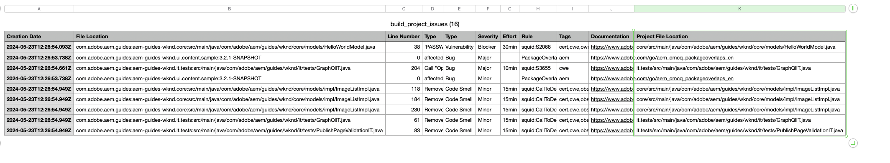

# Administrar canalizaciones {#managing-pipelines}

Obtenga información sobre cómo administrar las canalizaciones existentes, incluido ejecutarlas, editarlas y eliminarlas.

## Tarjeta de canalizaciones {#pipeline-card}

La tarjeta **Canalizaciones** de la página **Información general del programa** en Cloud Manager le ofrece una descripción general de todas sus canalizaciones y de su estado actual.

Al hacer clic en el botón de los tres puntos situado junto a cada canalización, puede realizar las siguientes acciones:

* [Ejecutar la canalización](#running-pipelines). 
* [Editar la canalización](#editing-pipelines).
* [Eliminar la canalización](#deleting-pipelines).
* [Ver detalles](#view-details).

En la parte inferior de la lista de canalizaciones, tiene opciones generales.

* **Añadir**: Para añadir [una nueva canalización de producción](/help/using/production-pipelines.md) o [una nueva canalización que no sea de producción](/help/using/non-production-pipelines.md)
* **Mostrar todo**: lleva al usuario a la pantalla **Canalizaciones** para ver todas las canalizaciones en una tabla más detallada
* **Acceder a la información de repositorios**: muestra la información necesaria para acceder al repositorio de Git de Cloud Manager
* **Más información**: navega hasta los recursos de documentación de canalización de CI/CD.

## Página Canalizaciones {#pipelines}

La página **Canalizaciones** muestra una lista completa de todas las canalizaciones del programa seleccionado. Esto resulta útil, ya que presenta información más completa que la disponible en la [Tarjeta de canalizaciones](#pipeline-card).

1. Inicie sesión en Cloud Manager en [my.cloudmanager.adobe.com](https://my.cloudmanager.adobe.com/) y seleccione la organización y programa adecuados.

1. En la página **Resumen del programa**, haga clic en la ficha **Canalizaciones** para cambiar a la página **Canalizaciones**.

1. Aquí puede ver una lista de todas las canalizaciones para el programa, así como iniciar y detener la ejecución de la canalización como lo haría en la **Tarjeta de canalizaciones**.

Al pulsar o hacer clic en el icono `i` se muestran detalles sobre la última o la actual ejecución de la canalización.

Hacer clic en **Ver detalles** le llevará a los [detalles de la ejecución de la canalización](#view-details).

## Página de actividad {#activity}

La página **Actividades** muestra una lista completa de todas las ejecuciones de canalizaciones para el programa seleccionado.

1. Inicie sesión en Cloud Manager en [my.cloudmanager.adobe.com](https://my.cloudmanager.adobe.com/) y seleccione la organización y programa adecuados.

1. En la página **Información general del programa**, haga clic en la ficha **Actividad** para cambiar a la página **Actividad**.

1. Aquí puede ver una lista de todas las ejecuciones de canalización del programa, incluidas las ejecuciones actuales e históricas.

Al hacer clic en el icono `i` se muestran los detalles sobre la ejecución de la canalización seleccionada.

Hacer clic en **Ver detalles** le llevará a los [detalles de la ejecución de la canalización](#view-details).

## Ejecutar canalizaciones {#running-pipelines}

1. Inicie sesión en Cloud Manager en [my.cloudmanager.adobe.com](https://my.cloudmanager.adobe.com/) y seleccione la organización y programa adecuados.
1. Vaya a la tarjeta **Canalizaciones** de la página **Información general del programa**.
1. Haga clic en el botón de los tres puntos situado junto a la canalización que ejecuta y, a continuación, en el menú, seleccione **Ejecutar**.

   La columna Estado indica cuándo comienza la ejecución de la canalización.

   Para ver los detalles de la ejecución, vuelva a hacer clic en el botón de los tres puntos y seleccione **[Ver detalles](#view-details)**.

   Según el tipo de canalización, puede cancelar la ejecución si hace clic de nuevo en el botón de los tres puntos y selecciona **Cancelar**.

## Editar canalizaciones {#editing-pipelines}

1. Inicie sesión en Cloud Manager en [my.cloudmanager.adobe.com](https://my.cloudmanager.adobe.com/) y seleccione la organización y programa adecuados.

1. Vaya a la tarjeta **Canalizaciones** de la página **Información general del programa** y haga clic en el botón de puntos suspensivos situado junto a la canalización que quiere editar. A continuación, seleccione **Editar** en el menú.

1. Aparecerá el cuadro de diálogo **Editar canalización de producción** o **Editar canalización que no sea de producción**. Puede editar los mismos detalles introducidos durante la creación de la canalización.

   Consulte [Configuración de canalizaciones de producción](/help/using/production-pipelines.md) y [Configuración de canalizaciones que no son de producción](/help/using/non-production-pipelines.md) para obtener detalles sobre los campos y las opciones de configuración disponibles para las canalizaciones.

1. Haga clic en **Actualizar** cuando haya terminado.

>[!NOTE]
>
>No se puede editar una canalización en ejecución.

## Eliminar canalizaciones {#deleting-pipelines}

1. Inicie sesión en Cloud Manager en [my.cloudmanager.adobe.com](https://my.cloudmanager.adobe.com/) y seleccione la organización y programa adecuados.

1. Vaya a la tarjeta **Canalizaciones** de la página **Información general del programa** y haga clic en el botón de puntos suspensivos situado junto a la canalización que quiere editar. A continuación, seleccione **Eliminar** en el menú.

>[!NOTE]
>
>No se puede eliminar una canalización en ejecución.

## Ver detalles {#view-details}

1. Inicie sesión en Cloud Manager en [my.cloudmanager.adobe.com](https://my.cloudmanager.adobe.com/) y seleccione la organización y programa adecuados.

1. Vaya a la tarjeta **Canalizaciones** de la página **Información general del programa** y haga clic en el botón de puntos suspensivos situado junto a la canalización que quiere editar. A continuación, seleccione **Ver detalles** en el menú.

1. Se le redirigirá a la página de detalles de la canalización en ejecución.

Desde aquí, puede ver el estado de los distintos pasos de la canalización y recuperar los registros de compilación para fines diagnósticos. Consulte el documento [Implementación de código](/help/using/code-deployment.md) para obtener más información.

Todos los pasos de la ejecución de una canalización se muestran con los que aún no se han iniciado en gris. Los pasos finalizados muestran su duración.

Una vez completado el paso de una canalización, se presenta un resumen.

Haga clic o pulse en el vínculo **Ver detalles** para mostrar la sección **Duración**. Esta sección incluye la duración promedio de la canalización en función de la tendencia histórica para ese programa.

Si la canalización contenía un paso **Escaneado de códigos** que ha planteado problemas, puede pulsar o hacer clic en el botón **Descargar detalles** para ver una lista de las [pruebas de calidad del código](/help/using/code-quality-testing.md) que no se han superado.

La columna de **Ubicación de archivos del proyecto** está disponible en el archivo CSV para indicar la ubicación del código infractor. Esta columna es la ruta relativa al proyecto, mientras que la columna **Ubicación del archivo** es generada por Maven.

>[!NOTE]
>
>Solo puede ver los detalles de una canalización que se esté ejecutando o que se haya ejecutado al menos una vez.
