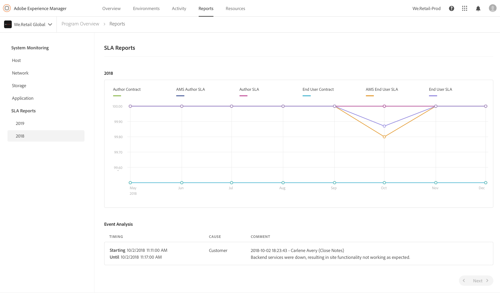

# Monitorización del sistema {#system-monitoring}

La supervisión del sistema en [!UICONTROL Cloud Manager] se realiza observando las instancias individuales dentro de un entorno y rastreando una variedad de métricas para cada instancia. Cada métrica tiene dos umbrales definidos: un *umbral de advertencia* y un *umbral crítico*.

Si una métrica supera su umbral crítico, se considera que está en estado crítico; si una métrica supera su umbral de advertencia (pero está por debajo de este umbral crítico), se considera que está en estado de advertencia. Los umbrales los establece Adobe Managed Services y se pueden visualizar en [!UICONTROL Cloud Manager]. En la mayoría de los casos, los umbrales son coherentes entre los clientes, pero en algunos casos Adobe Managed Services modificará los umbrales para adaptarlos a los requisitos específicos del cliente. Las preguntas sobre los umbrales deben dirigirse a su ingeniero de éxito del cliente (CSE).

## Navegar a Supervisión del sistema {#navigating-system-monitoring}

La navegación a la función Supervisión del sistema se puede realizar de dos maneras.

1. Inicie sesión en la página de aterrizaje de **Managed Services - Programs**.

   

1. Haga clic en el cuarto icono de la tarjeta del programa.

   

   *O bien*,

* Vaya a la página de aterrizaje **System Monitoring** mediante el elemento de menú de navegación global **Reports** dentro de [!UICONTROL Cloud Manager].

## Página de información general de supervisión del sistema {#system-monitoring-overview-page}

La página Información general sobre la supervisión del sistema enumera los entornos monitoreados en el programa e informa sobre su salud de alto nivel en cuatro categorías diferentes:

* **Host**
* **Almacenamiento**
* **Red**
* **Aplicación**

El estado de cada categoría es un resumen de métricas individuales: si alguna métrica de una categoría está en estado crítico, toda la categoría está en estado crítico para el propósito de la página de información general. La misma síntesis se puede ver a nivel de entorno y de instancia.

>[!NOTE]
>
>De forma predeterminada, al navegar a esta página, las instancias del entorno de producción están visibles, pero también se pueden abrir otros entornos.

## Tutorial de vídeo {#video-tutorial}

### Información general sobre los informes de Cloud Manager {#reports-video}

Los informes de Cloud Manager proporcionan una vista de los Entornos y las instancias de AEM del Programa a través de un conjunto de gráficos que informan y rastrean una variedad de métricas para cada instancia de AEM.
Consulte el siguiente vídeo para obtener más información.

>[!VIDEO](https://video.tv.adobe.com/v/26315/)

## Detalles de supervisión del sistema {#system-monitoring-detail}

Para ver los detalles de métricas específicas, puede hacer clic en una de las categorías en la navegación izquierda o en uno de los indicadores de categoría de una instancia específica. Cada página de detalles muestra una serie de gráficos para las métricas dentro de esa categoría. Puede ver las métricas de todas las instancias de un entorno o de una instancia específica. Puede cambiar entre el entorno y las instancias mediante los cuadros desplegables de la esquina superior derecha.

La navegación de la izquierda mostrará las métricas disponibles dentro de la categoría seleccionada actualmente para la que hay datos para el entorno y las instancias seleccionados actualmente.

Un gráfico individual mostrará el estado y un gráfico de los datos a lo largo del tiempo junto con los umbrales. Si se muestran varias instancias, los datos de cada instancia estarán en una serie independiente.

Las series individuales pueden ocultarse en un gráfico haciendo clic en la serie de la leyenda.
Por ejemplo, si hace clic en la serie de umbrales de advertencia, solo verá el umbral crítico.

### Definiciones de métricas {#metric-definitions}

**Host**

* Carga Por Núcleo: el número de procesos que están siendo ejecutados por la CPU o que están en estado de espera, promediado a lo largo de un período de un minuto (load1), cinco (load5) y quince (load15).
* Recuento de procesos: el número de procesos abiertos actualmente.
* Recuento de usuarios: el número de usuarios con una sesión shell activa.
* Uso de memoria: el porcentaje de memoria del sistema asignado actualmente.
* Memoria de JVM (montículo): el tamaño (en megabytes) del Java Heap asignado.
* Espacio de generación anterior: el porcentaje de memoria de generación anterior de JVM asignado actualmente.

**Red**

* Comprobación de puerto CQ: El tiempo de respuesta en segundos para acceder al puerto de AEM o Dispatcher. Existen diferentes métricas para autor, publicación y Dispatcher.

**Almacenamiento**

* Espacio en disco: El espacio en disco usado (en megabytes) para cada punto de montaje en el host. Hay diferentes métricas para cada punto de montaje. Como mínimo, verá métricas para &quot;/&quot; y &quot;/mnt&quot;, pero es posible que haya métricas de punto de montaje adicionales disponibles en función de la configuración de instancia específica.
* Tamaño de carpeta: Almacenamiento AEM segmentos: Espacio en disco utilizado (en gigabytes) para el Almacenamiento de segmentos de AEM.

**Aplicación**

* Agente de replicación: Tiempo, en segundos, para un evento de replicación de prueba. Hay métricas independientes para cada agente de replicación.
* Vaciado de Dispatcher: Número de elementos que hay actualmente en la cola de vaciado del despachante.

## Informes de SLA {#sla-reporting}

Los clientes pueden ver el rendimiento de su entorno de AEM de producción en relación con su contrato de contrato de nivel de servicio (SLA). Esta opción está disponible a través de un submenú en la pantalla Informes .
Por ejemplo, el gráfico siguiente muestra los logros mensuales de SLA para 2018.

Al igual que con los gráficos de monitorización del sistema, si se desplaza por un punto de datos se muestran los valores específicos de ese mes.

La sección Análisis de eventos bajo este gráfico muestra el conjunto de incidentes que ocurrieron para el programa durante el año seleccionado actualmente. Cada incidente tiene un intervalo de tiempo, una causa y un conjunto de comentarios.

## Métricas de SLA {#sla-metrics}

* **Contrato de autor**: Este es el SLA definido en su contrato con Adobe Managed Services para el nivel de creación.

* **SLA** de autor de AMS: Este es el tiempo de actividad medido de los incidentes de factorización de nivel de autor de producción causados por el Adobe o nuestros proveedores.

* **SLA** de autor: Este es el tiempo de actividad medido del nivel de creación que ignora el tiempo de inactividad programado, como las ventanas de mantenimiento.

* **Contrato de usuario final**: Este es el SLA definido en su contrato con Adobe Managed Services para el nivel de publicación.

* **SLA** del usuario final de AMS: Este es el tiempo de actividad medido de los incidentes de factorización del nivel de publicación de producción causados por el Adobe o nuestros proveedores.

* **SLA** del usuario final: Este es el tiempo de actividad medido del nivel de publicación que ignora el tiempo de inactividad programado, como las ventanas de mantenimiento.