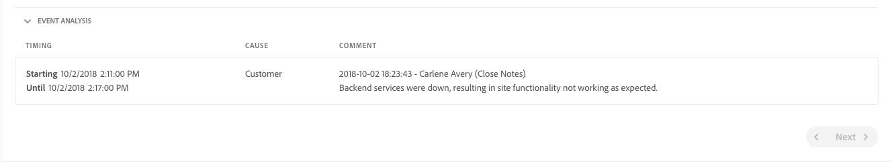

# Monitoreo del sistema {#system-monitoring}

La supervisión del sistema [!UICONTROL Cloud Manager] se realiza observando las instancias individuales dentro de un entorno y rastreando una variedad de métricas para cada instancia. Cada métrica tiene dos umbrales definidos: un umbral *de* advertencia y un umbral ** crítico.

Si una métrica supera su umbral crítico, se considera que se encuentra en un estado crítico; si una métrica está por encima de su umbral de advertencia (pero por debajo de su umbral crítico), se considera que está en estado de advertencia. Los umbrales los establecen los servicios administrados de Adobe y se pueden visualizar en [!UICONTROL Cloud Manager]. En la mayoría de los casos, los umbrales son coherentes entre los clientes, pero en algunos casos los servicios gestionados de Adobe modificarán los umbrales para que coincidan con los requisitos específicos del cliente. Las preguntas sobre los umbrales deben dirigirse a su ingeniero de éxito del cliente (CSE).

## Navegación a la supervisión del sistema {#navigating-system-monitoring}

La navegación a la función de supervisión del sistema se puede realizar de dos maneras.

1. Inicie sesión en la página de inicio **Managed Services - Programas** .

   

1. Haga clic en el tercer icono de la tarjeta del programa.

   

   *O bien*,

* Navegue hasta la página de aterrizaje de **System Monitoring** a través del elemento de menú de navegación global de **Informes** dentro de [!UICONTROL Cloud Manager].

## Página de información general de supervisión del sistema {#system-monitoring-overview-page}

La página Información general de supervisión del sistema enumera los entornos monitoreados en el programa e informa sobre su salud de alto nivel en cuatro categorías diferentes:

* **Host**
* **Almacenamiento**
* **Red**
* **Aplicación**

El estado de cada categoría es un resumen de métricas individuales: si alguna métrica de una categoría está en estado crítico, toda la categoría se encuentra en estado crítico para el propósito de la página de información general. El mismo resumen se puede ver a nivel de entorno y de instancia.

>[!NOTE]
>
>De forma predeterminada, al navegar a esta página, las instancias del entorno de producción están visibles, pero también se pueden abrir otros entornos.

## Vídeo de información general a informes {#video-reports}

Los informes Cloud Manager proporcionan una vista de los entornos del programa y de las instancias de AEM a través de un conjunto de gráficos que informan y rastrean una variedad de métricas para cada instancia de AEM.
Consulte el siguiente vídeo para obtener más detalles.

>[!VIDEO](https://video.tv.adobe.com/v/26315/?captions=spa)

## Detalles de supervisión del sistema {#system-monitoring-detail}

Para ver los detalles de métricas específicas, puede hacer clic en una de las categorías en la navegación izquierda o en uno de los indicadores de categoría de una instancia específica. Cada página de detalles muestra una serie de gráficos para las métricas dentro de esa categoría. Puede ver las métricas de todas las instancias de un entorno o de una instancia específica. Puede cambiar entre el entorno y las instancias mediante los cuadros desplegables de la esquina superior derecha.

La navegación de la izquierda mostrará las métricas disponibles dentro de la categoría seleccionada actualmente para la que hay datos para el entorno y las instancias seleccionados actualmente.

Un gráfico individual mostrará el estado y un gráfico de los datos a lo largo del tiempo junto con los umbrales. Si se muestran varias instancias, los datos de cada instancia estarán en una serie separada.

Las series individuales pueden ocultarse en un gráfico haciendo clic en la serie de la leyenda.
Por ejemplo, si hace clic en la serie de umbrales de advertencia, verá sólo el umbral crítico.

### Definiciones de métricas {#metric-definitions}

**Host**

* Carga por núcleo: el número de procesos que está ejecutando la CPU o que están en estado de espera, con un promedio de uno (carga1), cinco (carga5) y quince (carga15) minutos.
* Recuento de procesos: número de procesos abiertos actualmente.
* Recuento de usuarios: el número de usuarios con una sesión de shell activa.
* Uso de memoria: el porcentaje de memoria del sistema asignado actualmente.
* Memoria JVM (montón): el tamaño (en megabytes) del montón de Java asignado.
* Espacio de generación anterior: el porcentaje de memoria de generación anterior de JVM asignada actualmente.

**Red**

* Comprobación del puerto CQ: Tiempo de respuesta en segundos para acceder al puerto de AEM o Dispatcher. Existen diferentes métricas para autor, publicación y despachante.

**Almacenamiento**

* Espacio en disco: Espacio en disco usado (en megabytes) para cada punto de montaje en el host. Existen diferentes métricas para cada punto de montaje. Como mínimo, verá las métricas de "/" y "/mnt", pero es posible que haya métricas adicionales de punto de montaje disponibles en función de la configuración de instancia específica.
* Tamaño de la carpeta: Tienda de segmentos de AEM: Espacio en disco usado (en gigabytes) para el almacén de segmentos de AEM.

**Aplicación**

* Agente de replicación: Tiempo, en segundos, para un evento de replicación de prueba. Existen métricas independientes para cada agente de replicación.
* Dispatcher Flush: Número de elementos que hay actualmente en la cola de vaciado del despachante.

## Informes de SLA {#sla-reporting}

Los clientes pueden ver el rendimiento de su entorno de producción de AEM en relación con el contrato de nivel de servicio (SLA). Esto está disponible a través de un submenú en la pantalla Informes.
Por ejemplo: el gráfico siguiente muestra los logros mensuales de SLA en 2018.

Al igual que con los gráficos de supervisión del sistema, si se desplaza sobre un punto de datos se muestran los valores específicos de ese mes.

La sección Análisis de eventos de este gráfico muestra el conjunto de incidentes que ocurrieron para el programa durante el año seleccionado. Cada incidente tiene un intervalo de tiempo, una causa y un conjunto de comentarios.

## Métricas de SLA {#sla-metrics}

* **Contrato** de autor: Este es el SLA definido en su contrato con los servicios gestionados de Adobe para el nivel de creación.

* **SLA** de creación de AMS: Este es el tiempo de actividad medido de los incidentes de factoring de nivel de autor de producción causados por Adobe o nuestros proveedores.

* **SLA** de creación: Es el tiempo de actividad medido del nivel de creación que ignora el tiempo de inactividad programado, como las ventanas de mantenimiento.

* **Contrato** de usuario final: Este es el SLA definido en su contrato con los servicios gestionados de Adobe para el nivel de publicación.

* **SLA** del usuario final de AMS: Este es el tiempo de actividad medido de los incidentes de factorización del nivel de publicación de producción causados por Adobe o nuestros proveedores.

* **SLA** del usuario final: Es el tiempo de actividad medido del nivel de publicación que ignora el tiempo de inactividad programado, como las ventanas de mantenimiento.