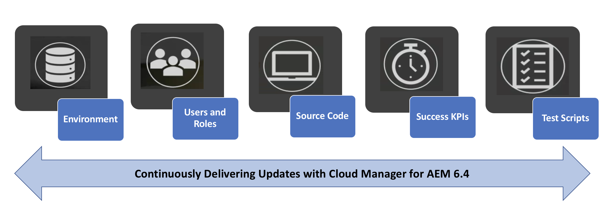
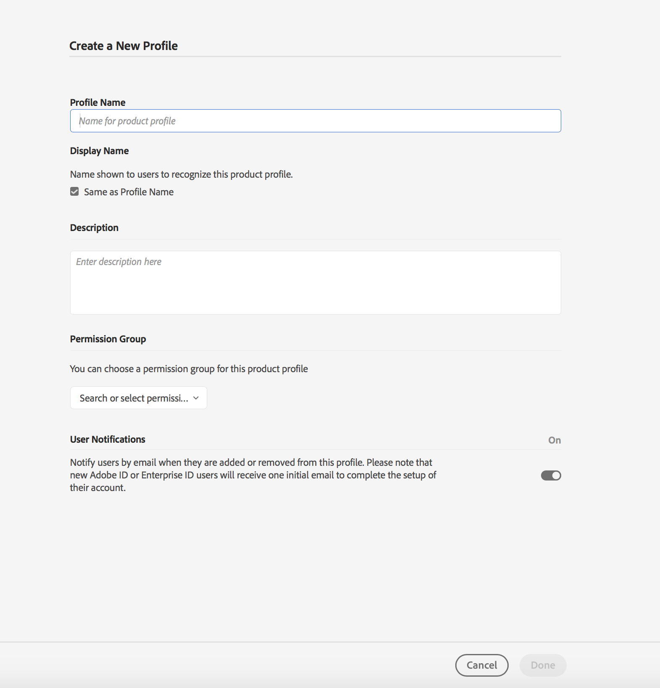

# Configuración general de [!UICONTROL Cloud Manager]{#setting-up-general-configurations-for-cloud-manager}

La siguiente sección resalta los requisitos previos para configurar [!UICONTROL Cloud Manager] y administrar contenido desde su interfaz de usuario.

Esta página de sección cubre los siguientes temas

* **Configuración de usuarios y funciones**
* **Configuración del proyecto de la aplicación AEM**
* **Configuraciones del despachante**
* **Optimizaciones para el desarrollo**

El diagrama siguiente ilustra las diferentes funciones que permiten [!UICONTROL Cloud Manager] ofrecer continuamente código de mejor calidad:



## Configuración de usuarios y funciones {#setting-up-users-and-roles}

Las funciones se administran desde [!UICONTROL Cloud Manager] Adobe Admin Console. Los miembros específicos de funciones se proporcionan agregando el usuario a un perfil de [!UICONTROL Cloud Manager] producto en Admin Console.

>[!CAUTION]
>
>Para usar [!UICONTROL Cloud Manager], debe tener un Adobe ID y el contexto de producto de los servicios administrados de Adobe.

Puede asignar pertenencias a funciones específicas agregando el usuario a un perfil [!UICONTROL Cloud Manager] de producto en Admin Console.

Cree las siguientes funciones mediante la Consola de administración para [!UICONTROL Cloud Manager]:

>[!NOTE]
>
>Adobe Admin Console proporciona una ubicación central para administrar las autorizaciones de Adobe en toda la organización.
>
>Para obtener más información sobre Adobe Admin Console, consulte la documentación de [Admin Console](https://helpx.adobe.com/enterprise/using/admin-console.html).

| **[!UICONTROL Cloud Manager]Funciones** | **Descripción** |
|---|---|
| Propietario del negocio | Responsable de definir KPI, aprobar implementaciones de producción y anular errores importantes de tres niveles. |
| Administrador de programas | Utiliza [!UICONTROL Cloud Manager] para realizar la configuración del equipo, revisar el estado y ver KPI. Puede aprobar errores importantes de tres niveles. |
| Administrador de implementación | Gestiona las operaciones de implementación. Utiliza [!UICONTROL Cloud Manager] para ejecutar implementaciones de fase/producción. Puede aprobar errores importantes de tres niveles. Tiene acceso git. |
| Desarrollador | Desarrolla y prueba el código de aplicación personalizado. Se utiliza principalmente [!UICONTROL Cloud Manager] para ver el estado. Tiene acceso de confirmación a git. |
| Ingeniero de éxito del cliente | Generalmente admite el éxito del cliente para los clientes de AMS. Interactúa con [!UICONTROL Cloud Manager] el fin de ejecutar despliegues que requieren supervisión de CSE. |
| Autor de contenido | Generalmente no interactúa con [!UICONTROL Cloud Manager]. Puede utilizar [!UICONTROL Cloud Manager] el conmutador de programas (después de haber navegado desde [!UICONTROL Experience Cloud]) para acceder a AEM. |

### Uso de la Consola de administración para configurar el equipo {#using-admin-console-to-set-up-team}

Para proporcionar a [!UICONTROL Cloud Manager] los usuarios los permisos adecuados basados en funciones, un administrador de la organización del cliente debe crear nuevos perfiles de producto en el contexto [!UICONTROL AEM Managed Services] de producto.

>[!NOTE]
>
>Para acceder a la consola de administración y configurar su equipo (usuarios y funciones), abra un navegador y visite [https://adminconsole.adobe.com](https://adminconsole.adobe.com/enterprise).

La adición de usuarios (o grupos) a estos perfiles de producto se realiza mediante la funcionalidad normal de la Consola de administración, como se muestra en la figura siguiente:

1. Inicie sesión en Admin Console y haga clic en **Nuevo perfil** para agregar un nuevo perfil.

   

1. Rellene los campos para configurar una nueva función [!UICONTROL Cloud Manager].

   Introduzca el nombre **** del perfil, **la descripción** , para crear un nuevo perfil. Además, puede seleccionar un grupo **de** permisos para el perfil.

   Haga clic en **Listo** para completar el paso de creación del perfil.

   

## Configuración del proyecto de la aplicación AEM {#aem-application-project-setup}

Antes de configurar el proyecto de aplicación en [!UICONTROL Cloud Manager], tendrá que considerar uno de los dos escenarios. Es posible que sea nuevo en AEM 6.4 o que ya sea cliente existente.

>[!NOTE]
>
>Para tener acceso a [!UICONTROL Cloud Manager], póngase en contacto con los ingenieros de éxito del cliente (CSE) para obtener la dirección URL y las credenciales para empezar.

Puede configurar un proyecto de aplicación para [!UICONTROL Cloud Manager], en función de los dos escenarios siguientes:

* **Nuevo proyecto** de AEM:

Un nuevo proyecto de AEM aprovechará el proyecto existente y trabajará con [!UICONTROL Cloud Manager].

Para obtener más información, consulte [Introducción a AEM 6.4](https://chl-author./content/help/en/experience-manager/6-4/sites/deploying/using/deploy.html). Además, consulte Recursos [](https://www.adobe.com/marketing-cloud/experience-manager/resources.html?promoid=759X6WV8&mv=other) AEM para obtener más información.

* **Proyecto** de AEM existente:

Un proyecto de AEM existente debe confirmar las reglas para la configuración del proyecto. Puede actualizar la instalación de AEM existente para obtener nuevas funciones y mejoras ofrecidas en AEM 6.4 y empezar a utilizarlo [!UICONTROL Cloud Manager]. Estos criterios deberían funcionar con cambios mínimos. Póngase en contacto con los ingenieros de éxito del cliente (CSE) para obtener soporte técnico.

Para obtener información adicional sobre la actualización de la instancia de AEM a la 6.4, consulte [Actualización a AEM 6.4](https://helpx.adobe.com/experience-manager/6-4/sites/deploying/using/upgrade.html).

### Configuración del repositorio {#setting-up-repository}

Se aprovisiona un único repositorio de git, inicialmente vacío, para cada programa incorporado en [!UICONTROL Cloud Manager]. Los desarrolladores y administradores de implementación reciben la dirección URL de Git y las credenciales de su CSE.

Con esta información, un desarrollador puede agregar su código, siguiendo las directrices de **Configuración del proyecto **en la sección siguiente, para completar los requisitos de configuración antes de Usar [!UICONTROL Cloud Manager].

## Configuraciones del despachante {#dispatcher-configurations}

[!UICONTROL Cloud Manager] puede implementar archivos de configuración del servidor web y del despachante siempre que se almacenen en el repositorio git, además de los paquetes de contenido normales de AEM.

Para aprovechar esta capacidad, la compilación de Maven produce un archivo zip que contiene dos directorios: ***conf*** y ***conf.d***.

Tras la implementación en una instancia de distribuidor, el contenido de estos directorios sobrescribirá el contenido de estos directorios en la instancia de distribuidor. Debido a que los archivos de configuración del servidor web y del despachante requieren con frecuencia información específica del entorno, para que esta capacidad se utilice correctamente, primero deberá trabajar con sus Ingenieros de éxito del cliente (CSE) para extraer estas variables de entorno en /etc/sysconfig/httpd.

Siga los pasos a continuación para completar el proceso inicial de configuración del despachante:

1. Obtenga los archivos de configuración de producción actuales de su CSE.
1. Elimine los datos específicos del entorno codificados (por ejemplo, la IP del procesador de publicación) y los reemplace por variables.
1. Defina las variables requeridas en pares de clave-valor para cada distribuidor de destino y solicite a CSE que agregue a ***/etc/sysconfig/httpd*** en cada instancia.
1. Pruebe las configuraciones actualizadas en el escenario y, a continuación, solicite a CSE que implemente en producción para garantizar que funcionan correctamente.
1. Transferir archivos a Git.
1. Implementar mediante [!UICONTROL Cloud Manager].

El archivo zip real se puede producir usando el complemento maven-assembly-plugin. Los proyectos generados con la plantilla multimódulo AEM de Lazybones pueden tener la estructura de proyecto Maven adecuada como parte de la creación del proyecto.

>[!NOTE]
>
>La configuración del despachante se realiza durante la integración [!UICONTROL Cloud Manager], pero también se puede realizar en una etapa posterior.

### Configuración de Dispatcher para Pruebas de Rendimiento {#configuring-dispatcher-for-performance-testing}

Para [!UICONTROL Cloud Manager] ejecutar correctamente las pruebas de rendimiento, el servidor del distribuidor de etapas debe responder a los mismos nombres de host que el distribuidor de producción de forma coherente con el servidor de producción.

*Por ejemplo*, si un cliente tiene [www.myco.com](http://www.myco.com/) y [www.myotherco.com](http://www.myotherco.com,/) como nombres de host de producción y stage-myco.adobecqms.net como nombre de host de etapa, una solicitud como esta debe responder correctamente:

```
curl -H"Host: www.myco.com" http://stage-myco.adobecqms.net/en/home.html
```

Esto requerirá no sólo que los nombres de host estén correctamente configurados en la configuración del despachante, sino también que ***/etc/map***, cualquier Apache reescriba o cualquier otra regla de ***asignación/filtro*** de ruta se implemente de manera consistente entre etapa y producción.

## Optimizaciones para el desarrollo {#development-best-practices}

Antes de usar [!UICONTROL Cloud Manager], es aconsejable conocer algunas prácticas recomendadas para configurar proyectos y configurar servidores web o depausar la configuración.

### Configuración del proyecto {#project-set-up}

Sus proyectos deben cumplir algunos criterios para trabajar con [!UICONTROL Cloud Manager].

Siga las optimizaciones para configurar proyectos en [!UICONTROL Cloud Manager]:

* La única herramienta de compilación proporcionada y admitida es Apache Maven. Se ha instalado Apache Maven 3.3.9.
* Los compiladores se ejecutan en un entorno Linux en un contenedor de Docker como usuario raíz.
* La versión de Java instalada es Oracle JDK 8u161.
* Hay algunos paquetes de sistema adicionales instalados, como bzip2, unzip, libpng, imagemagick y graphicsmagick. Si necesita otros paquetes, deberá solicitarlos a través de su CSE.
* Maven siempre se ejecuta con el comando mvn -B clean package.
* Se le proporcionará exactamente un repositorio git. Debe haber un archivo pom.xml en la raíz de este repositorio. Este archivo pom.xml puede referirse a tantos submódulos (que a su vez pueden tener otros submódulos, etc.) si es necesario, pero sólo debe haber un punto de entrada.
* Maven se configura a nivel del sistema con un archivo settings.xml que incluye automáticamente el repositorio público de artefactos de Adobe (repo.adobe.com).
* Puede agregar repositorios adicionales en los archivos pom.xml. Sin embargo, no se admite el acceso a repositorios de artefactos protegidos por contraseña o de red.
* Los paquetes de contenido implementable se descubren mediante la búsqueda de archivos zip contenidos en un directorio denominado target. Nuevamente, cualquier número de submódulos puede producir paquetes de contenido.
* Si hay más de un paquete de contenido, no se garantiza el orden de las implementaciones de paquetes. Si se necesita un orden específico, se pueden usar dependencias de paquetes de contenido para definir el orden.

<!-- 

Comment Type: annotation
Last Modified By: jsyal
Last Modified Date: 2018-05-02T18:18:15.028-0400

change as per KT

 -->

### Pasos siguientes {#the-next-steps}

Una vez que haya configurado las configuraciones generales, estará listo para usar [!UICONTROL Cloud Manager].

Consulte [Uso de [!UICONTROL Cloud Manager]](https://helpx.adobe.com/experience-manager/cloud-manager/using/using-cloud-manager.html) para comenzar con [!UICONTROL Cloud Manager].
