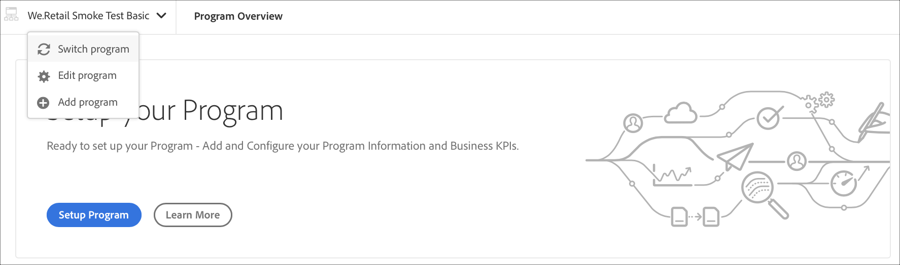

# Configurar el programa {#setup-your-program}

Después de la incorporación, el propietario de la empresa deberá completar la configuración inicial del programa. Esto implica configurar la descripción del programa y definir los indicadores clave de rendimiento (KPI) que se utilizarán para las pruebas de rendimiento. Opcionalmente, se puede cargar una miniatura. Además, el propietario del negocio puede configurar el aprovisionamiento de entornos mientras configura el programa.

Los KPI definidos sirven como punto de referencia para las pruebas de rendimiento que se pasan cada vez que se ejecuta la canalización.

>[!NOTE]
>
>Los KPI definidos se miden en pruebas ejecutadas en el entorno **stage**. Normalmente, estos KPI se reducen para adaptarse a las capacidades del entorno de ensayo.
>
>Por ejemplo, si un usuario espera un promedio de 1000 vistas de página por minuto en su **Entorno** de producción y tiene cuatro servidores de Dispatcher/publicación en producción, debe escalarlo a 250 vistas de página por minuto (suponiendo que su entorno de ensayo consista únicamente en un único par de Dispatcher/servidor de publicación).
>
>Además, muchos usuarios tendrán una red de entrega de contenido (CDN), como Akamai o CloudFront, delante de su entorno de producción. Dado que [!UICONTROL Cloud Manager] prueba directamente con el entorno de ensayo, el KPI debe reflejar únicamente el tráfico que se espera pase a través de la CDN, es decir, la caché no pasa. Normalmente, este será un subconjunto relativamente pequeño del tráfico total de producción.

## Uso de [!UICONTROL Cloud Manager] para configurar el programa {#using-cloud-manager-to-setup-your-program}

Siga los pasos a continuación para configurar el programa y definir los KPI:

1. Haga clic en **Programa de instalación** para iniciar el proceso de configuración en [!UICONTROL Cloud Manager].

   

   >[!NOTE]
   > Siempre puede cambiar, editar o agregar un nuevo programa desde la barra de acciones, como se muestra en la figura siguiente.

   

1. La pantalla **Programa de instalación** muestra la información Editar programa.

1. Verá tres opciones como **General**, **KPI** y **Provisioning**.

1. En la pestaña **General**, cargue una miniatura en el programa. También puede agregar una descripción relevante al programa.

   

1. En **KPI**, puede definir sus dos KPI (expectativas para cada implementación). Los KPI independientes se definen para **AEM Sites** y **AEM Assets**. Podrá especificar los KPI para los productos con licencia.

   **AEM Sites**

   1. ¿Cuál es el tiempo de respuesta del percentil 95 que es aceptable para usted?

      * Valor recomendado: 3 segundos
   1. ¿Cuántas vistas de página por minuto bajo la carga máxima?

      * Valor recomendado: 200 vistas de página por minuto

   **AEM Assets**

   Desde su versión inicial, Cloud Manager ha podido ejecutar pruebas de rendimiento para programas de AEM Sites. Con esta versión, también se ha agregado la capacidad para ejecutar pruebas de rendimiento para programas de AEM Assets. La prueba de rendimiento de los recursos se realiza cargando los recursos repetidamente durante un período de prueba de 30 minutos y midiendo el tiempo de procesamiento de cada recurso, así como varias métricas a nivel del sistema.
Durante la configuración del programa, se especifican los KPI específicos de los recursos:

   * Tiempo de procesamiento del percentil 95
   * Recursos cargados por minuto

   

1. En **Provisioning**, puede ver o editar la configuración de aprovisionamiento para entornos de producción y no de producción en su programa. Verá **Autoscale está activado** si el escalado automático se ha activado para el programa.

   >[!NOTE]
   >
   >* La función de escalado automático solo se aplica al entorno de producción y es posible que no esté disponible para todos los programas para clientes.
   >* El escalado bajo demanda no está disponible para esta versión de [!UICONTROL Cloud Manager].

   

1. Haga clic en **Guardar** para completar el asistente de configuración.

   >[!NOTE]
   >
   >Siempre puede editar el programa una vez que el programa inicial ya esté configurado. Siga los pasos a continuación para obtener más información.

## Edición de un programa

1. Vaya a la solución en la pantalla de inicio de **Cloud Manager**.

   

1. Seleccione la solución y haga clic en **Editar** para actualizar o modificar su programa, como se muestra en la figura siguiente.

   

1. Se muestra la pantalla **Editar programa** que permite actualizar o modificar el programa.

   

## Pasos siguientes {#the-next-steps}

Si ya ha configurado la **Canalización**, la siguiente ejecución tendrá en cuenta la configuración actualizada. Si aún no ha configurado la canalización, siga los pasos para configurarla primero.

Consulte [Configurar la canalización de CI/CD](https://helpx.adobe.com/experience-manager/cloud-manager/using/configuring-pipeline.html) para configurar la canalización.
