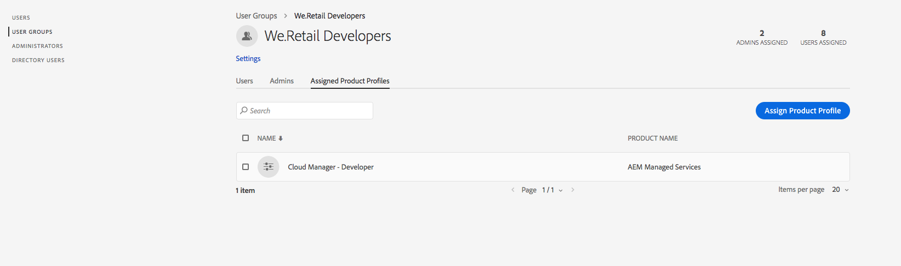

# Agregar usuarios y funciones {#add-users-and-roles}

Muchas funciones de [!UICONTROL Cloud Manager] requieren permisos específicos para funcionar. Por ejemplo, solo se permite a ciertos usuarios establecer los indicadores de rendimiento clave (KPI) para un programa. Estos permisos se agrupan lógicamente en funciones.

[!UICONTROL Cloud Manager] actualmente define cuatro funciones para los usuarios que rigen la disponibilidad de funciones específicas:

* Propietario del negocio
* Administrador de programa
* Administrador de implementación
* Desarrollador

>[!CAUTION]
>
>Para utilizar [!UICONTROL Cloud Manager], debe tener un Adobe ID y el contexto del producto de Adobe Managed Services.

## Definiciones de funciones {#role-definitions}

>[!NOTE]
>
>El perfil de desarrollador en Admin Console no está relacionado con la función de desarrollador en [!UICONTROL Cloud Manager].

La siguiente tabla resume las funciones:

| [!UICONTROL Cloud Manager] Funciones | Descripción |
|--- |--- |
| Propietario del negocio | Responsable de definir KPI, aprobar implementaciones de producción y anular errores importantes de tres niveles. |
| Administrador de programa | Utiliza [!UICONTROL Cloud Manager] para realizar la configuración del equipo, revisar el estado y ver los KPI. Pueden aprobar errores importantes de tres niveles. |
| Administrador de implementación | Gestiona las operaciones de implementación. Utiliza [!UICONTROL Cloud Manager] para ejecutar implementaciones de fase/producción. Puede editar canalizaciones de CI/CD. Pueden aprobar errores importantes de tres niveles. Puede obtener acceso al repositorio de Git. |
| Desarrollador | Desarrolla y prueba el código de aplicación personalizado. Principalmente utiliza [!UICONTROL Cloud Manager] para ver el estado. Puede obtener acceso al repositorio de Git para la confirmación de código. |
| Ingeniero de éxito del cliente | Generalmente admite el éxito de los clientes para los clientes de AMS. Interactúa con [!UICONTROL Cloud Manager] con el fin de ejecutar implementaciones que requieren supervisión del CSE. |
| Autor de contenido | Generalmente no interactúa con [!UICONTROL Cloud Manager]. Puede utilizar el [!UICONTROL Cloud Manager] conmutador de programas (habiendo navegado desde [!UICONTROL Experience Cloud]) para acceder a AEM. |

## Uso del Admin Console para crear un perfil {#using-admin-console-to-create-a-profile}

Las funciones se administran para [!UICONTROL Cloud Manager] desde Adobe Admin Console. Para obtener miembros de funciones específicas, agregue el usuario a un [!UICONTROL Cloud Manager] Perfil de producto en el Admin Console.

Puede asignar miembros de funciones específicas agregando el usuario a un perfil de producto[!UICONTROL Cloud Manager] de **** en Adobe Admin Console, una ubicación central para administrar las autorizaciones de Adobe en toda la organización. Para obtener más información sobre Adobe Admin Console, consulte la documentación de [Admin Console](https://helpx.adobe.com/es/enterprise/using/admin-console.html).

>[!NOTE]
>
>Para acceder a Admin Console y configurar su equipo (usuarios y funciones), abra un explorador y visite [https://adminconsole.adobe.com](https://adminconsole.adobe.com/enterprise).

Para proporcionar los permisos adecuados basados en funciones a los usuarios de [!UICONTROL Cloud Manager], un administrador de la **organización** del cliente debe crear nuevos perfiles de producto en el contexto de producto de [!UICONTROL AEM Managed Services].

Para proporcionar los permisos adecuados basados en funciones a los usuarios de [!UICONTROL Cloud Manager] , como administrador debe crear cuatro nuevos perfiles de producto en el contexto de producto [!UICONTROL AEM Managed Services] correspondiente a cada una de las cuatro funciones de [!UICONTROL Cloud Manager] :

* Propietario del negocio
* Administrador de implementación
* Desarrollador
* Administrador de programa

Puede crear o agregar usuarios/grupos a estos perfiles de producto con el [Admin Console](https://adminconsole.adobe.com/) para [!UICONTROL Cloud Manager], como se muestra en la figura siguiente:

1. Inicie sesión en Admin Console y haga clic en **Nuevo perfil** para agregar un nuevo perfil.

   

1. Complete los campos para configurar una nueva función para [!UICONTROL Cloud Manager].

   Introduzca el **Nombre del perfil** y **Nombre para mostrar** para crear un nuevo perfil. Además, puede seleccionar un **grupo de permisos** para el perfil.

   Haga clic en **Listo** para completar el paso de creación del perfil.

   >[!NOTE]
   >
   >Al crear estos perfiles de producto, el **Nombre para mostrar** debe ser el valor técnico definido por [!UICONTROL Cloud Manager] (consulte la tabla siguiente). El **nombre del perfil** puede ser cualquier cosa, aunque para evitar confusiones, se recomienda usar los valores de la columna *Nombre del perfil* recomendado que aparece a continuación. Para ello, al crear el perfil de producto, desactive la casilla **Igual que el nombre de perfil** y especifique el valor correspondiente como **Nombre para mostrar**.

   | **Función** | **Nombre para mostrar (obligatorio)** | **Nombre de perfil recomendado** |
   |---|---|---|
   | Propietario del negocio | CM_BUSINESS_OWNER_ROLE_PROFILE | [!UICONTROL Cloud Manager] - Rol de propietario del negocio |
   | Administrador de implementación | CM_DEPLOYMENT_MANAGER_ROLE_PROFILE | [!UICONTROL Cloud Manager] - Función de administrador de implementación |
   | Desarrollador | CM_DEVELOPER_ROLE_PROFILE | [!UICONTROL Cloud Manager] - Función de desarrollador |
   | Administrador de programa | CM_PROGRAM_MANAGER_ROLE_PROFILE | [!UICONTROL Cloud Manager] - Función de administrador de programas |

   

1. Una vez creado el perfil de producto, puede agregar usuarios (o grupos) a estos perfiles de producto.

   

   

