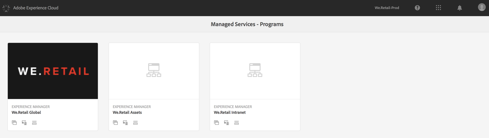
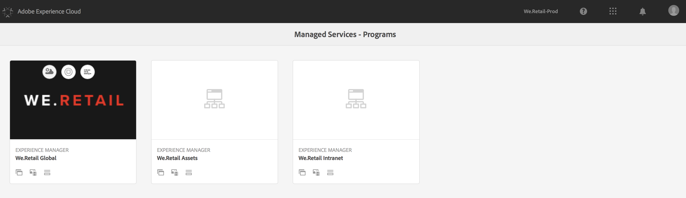

# Uso de Cloud Manager{#using-cloud-manager}

En esta sección se explica la interfaz de usuario y [!UICONTROL Cloud Manager] la explicación del flujo de trabajo de la configuración del programa a la implementación seguida de las comprobaciones de calidad.

## Requisitos previos {#prerequisites}

Antes de obtener los detalles del uso de [!UICONTROL Cloud Manager], se recomienda ir a las siguientes secciones:

* [Explicación de los conceptos antes de utilizar [! UICONTROL Cloud Manager]](understanding-concepts.md)
* [Configuración de configuraciones generales para [! UICONTROL Cloud Manager]](setting-configurations-for-cloud-manager.md)

## Introducción a [!UICONTROL Cloud Manager]{#getting-started-with-cloud-manager}

Una vez configuradas las configuraciones generales, [!UICONTROL Cloud Manager]está listo para utilizar [!UICONTROL Cloud Manager]la.

1. Inicie sesión en Adobe [!UICONTROL Experience Cloud] y verá la lista de soluciones.

   

1. Seleccione el programa y haga clic en el icono superior izquierdo para abrirlo [!UICONTROL Cloud Manager].

   

## Configuración del programa {#setting-up-program}

Tras la integración, el propietario del negocio deberá realizar alguna configuración inicial del programa. Esto implica configurar la descripción del programa y definir los KPI que se utilizarán para la prueba de rendimiento. Opcionalmente, se puede cargar una miniatura.

Los KPI definidos sirven como referencia para la prueba de rendimiento que se pasa cada vez que se ejecuta la canalización.

>[!NOTE]
>
>Los KPI definidos se miden en las pruebas ejecutándose en el entorno **de etapa** . Normalmente, estos KPI se reducen para adaptarse a las capacidades del entorno de etapa.
>
>Por ejemplo, un usuario espera un promedio de 1000 vistas de página por minuto en el entorno de producción y tener cuatro `dispatcher/publish` servidores en producción debería escalar esto a 250 vistas de página por minuto (suponiendo que su entorno de etapa consiste solamente en un par `dispatcher/publish` de servidor único).
>
>Además, muchos usuarios tendrán un CDN (Akamai, cloudfront) delante del entorno de producción. Dado que [!UICONTROL Cloud Manager] las pruebas todavía se comparan directamente con el entorno de etapa, el KPI debe reflejar solamente el tráfico esperado para pasar por el CDN, es decir, la caché se deshace. Generalmente, éste será un subconjunto relativamente pequeño del tráfico total de producción.

### Uso [!UICONTROL Cloud Manager] para definir KPI {#using-cloud-manager-to-define-kpis}

Siga los pasos a continuación para configurar el programa y definir KPI:

1. Click **Setup Program** to start the setup process in [!UICONTROL Cloud Manager].
1. Aparece la pantalla **Editar información** del programa.

   Cargue una miniatura en el programa. También puede agregar una descripción relevante al programa y hacer clic **en Siguiente**.

1. Se abre la pantalla **Configurar usuarios** .

   Puede configurar las funciones y los usuarios de su equipo. Haga clic en **Siguiente**. 

1. Se abre la **pantalla Configurar KPI** empresariales generales.

   Puede definir los dos KPI (expectativas para cada implementación):

   1. ¿Cuál es el tiempo de respuesta de percentil 95 que es aceptable para usted?

      1. Valor recomendado - 3 segundos
   1. ¿Cuántas vistas de página por minuto bajo la carga máxima?

      1. Valor recomendado - 200 pv/m


1. Haga clic **en Enviar** para completar el asistente de configuración.

   Verá la pantalla principal para [!UICONTROL Cloud Manager] cambiar a **Implementación**.

## Entornos disponibles {#available-environments}

Los entornos **disponibles** en la [!UICONTROL Cloud Manager] lista de todos los entornos de AEM gestionados.

Cada uno de los entornos enumerados tendrá un estado asociado.

## Configuración de Pipeline {#configuring-pipeline}

### Configuración de Pipeline {#setting-up-pipeline}

>[!CAUTION]
>
>La canalización no se puede configurar hasta que el repositorio de git tenga al menos una rama.

Antes de comenzar a implementar el código, debe configurar su configuración de canal desde [!UICONTROL Cloud Manager].

Para obtener más información sobre la configuración de canal, consulte **la sección Información general** de Pipeline en** [Explicación de conceptos antes de usar [! UICONTROL Cloud Manager]](understanding-concepts.md)**.

>[!NOTE]
>
>Puede cambiar la configuración del canal después de la configuración inicial.

### Configuración de la configuración de pipeline desde la variable [!UICONTROL Cloud Manager]{#configuring-pipeline-settings-from-the-cloud-manager}

Siga los pasos a continuación [!UICONTROL Cloud Manager] para configurar los bahavior y las preferencias del canal:

1. Acceda a la ficha **Rama** para configurar la ramificación de la aplicación.

   Seleccione la ramificación de git que desee configurar.

   >[!NOTE]
   >
   >Las ramas que se encuentran en el repositorio de Git están vinculadas al programa.

   

1. Acceda a la ficha **Entornos** para seleccionar **las opciones Etapa** y **Producción** .

   Puede definir el activador que iniciará la canalización:

   * **Manual** : alguien tiene que hacer clic manualmente en la interfaz de usuario para iniciar la canalización.
   Ahora define los parámetros que controlan la implementación de producción. Las tres opciones disponibles son las siguientes:

   * **Usar aprobación en lanzamiento**: un propietario de negocio, un administrador de proyectos o un gestor de implementación deben aprobar una implementación manualmente a través de [!UICONTROL Cloud Manager] la interfaz de usuario.
   * **Usar CSE Monitoring** - A CSE is engaged to really start the deployment.
   

1. Acceda a la ficha **Pruebas** para definir los criterios de prueba del programa.

   Ahora puede configurar los parámetros de prueba de rendimiento.

   

## Implementación de código {#deploying-code}

Una vez configurado el canal (repositorio, entorno y entorno de prueba), podrá implementar su código.

### Implementación de código desde [!UICONTROL Cloud Manager]{#deploying-code-from-cloud-manager}

Siga los pasos a continuación para implementar el código en el entorno de producción:

1. Haga clic **en Implementar** desde [!UICONTROL Cloud Manager] para iniciar el proceso de implementación.
1. Se abre **la pantalla Implementación** del escenario.

   Haga clic **en Generar** para iniciar el proceso.

1. El proceso de generación completo tiene en cuenta varios parámetros para comprobar e implementar el código.

   Los siguientes parámetros que están marcados son los siguientes:

   **Implementación del escenario**

   * Repositorio
   * Prueba de unidad
   * Digitalización de código
   * Implementado en el entorno de escenario
   **Pruebas previas a la producción**

   * Prueba de seguridad
   * Prueba de rendimiento
   >[!NOTE]
   >
   >Además, puede ver registros o revisar los resultados para los criterios de prueba mencionados anteriormente.

## Resultados de las comprobaciones de calidad {#results-from-quality-checks}

Hay tres puertas en el canal: Calidad del código, Prueba de rendimiento y Prueba de seguridad.

Para cada una de estas puertas, existe una estructura de tres niveles para los problemas identificados por la puerta.

* **Crítico** : Son problemas identificados por la puerta que provocan un fallo inmediato en la canalización.
* **Importante** : Son problemas identificados por la puerta que hacen que el canal introduzca un estado pausado. Un administrador de implementación, un administrador de proyectos o un propietario comercial pueden anular los problemas, en cuyo caso el canalizador continúa o puede aceptar los problemas, en cuyo caso la canalización se detiene con un error.
* **Información** : Son problemas identificados por la computación que se proporcionan exclusivamente con fines informativos y no tienen impacto en la ejecución del canal.

### Digitalización de código {#code-scanning}


### Prueba de rendimiento {#performance-testing}

*Las pruebas de rendimiento* se [!UICONTROL Cloud Manager] implementan mediante una prueba durante 30 minutos.

Durante la configuración de la canalización, el administrador de implementación puede decidir cuánto tráfico dirigir a cada bloque. Pueden elegir entre uno y tres bloques. La distribución del tráfico se basa en el número de bloques seleccionados, es decir, si se seleccionan los tres, el 33% del total de vistas de página se sitúa en cada bloque; si se seleccionan dos, el 50% va a cada conjunto; Si se selecciona uno, el 100% del tráfico va a dicho conjunto.

Por ejemplo: supongamos que hay un 50%/50% dividido entre las Páginas interactivas populares y las Páginas nuevas (en este ejemplo no se utiliza Otras páginas Live) y el conjunto Nuevas páginas contiene 3000 páginas. Las vistas de página por minuto KPI se establecen en 200. Durante el período de prueba de 30 minutos:

* Cada una de las 25 páginas del conjunto Páginas activas populares se visita 240 veces - `((200 &#42; 0.5) / 25) &#42; 30 = 120`
* Cada una de las 3000 páginas del conjunto de páginas nuevas se visita una vez: `((200 &#42; 0.5) / 3000) &#42; 30 = 1`


### Métricas de prueba de rendimiento {#performance-test-metrics}

Durante el período de prueba, se capturan varias métricas y se comparan con los KPI definidos por el propietario del negocio o con los estándares establecidos por AMS.

Se registran usando el sistema de gating de tres niveles como se indica a continuación:

### Puertas de tres niveles al ejecutar un canal {#three-tier-gates-while-running-a-pipeline}

Hay tres puertas en la canalización como Calidad del código, Prueba de rendimiento y Prueba de seguridad.

Para cada una de estas puertas, existe una estructura de tres niveles para los problemas identificados por el portal:

* **Crítico**: Se trata de problemas identificados por la puerta de enlace que producen un fallo inmediato en la canalización.
* **Importante**: Se trata de problemas identificados por la puerta que provocan que el canal introduzca un estado pausado. Un administrador de implementación, un administrador de proyectos o un propietario comercial pueden anular los problemas, en cuyo caso el canalizador continúa o puede aceptar los problemas, en cuyo caso la canalización se detiene con un error.
* **Información**: Se trata de problemas identificados por la compuerta que se proporcionan exclusivamente con fines informativos y que no tienen impacto en la ejecución del canal.

En la tabla siguiente se resume la matriz de prueba de rendimiento utilizando el sistema de gating de tres niveles:

| **Métrica** | **Categoría** | **Umbral de error** |
|---|---|---|
| Tasa de error de solicitud de página % | Crítico | &gt;= 2% |
| Tasa de uso de CPU | Crítico | &gt;= 80% |
| Tiempo de espera de la IO de disco | Crítico | &gt;= 50% |
| 95 tiempo de respuesta del percentil | Importante | &gt; = KPI de nivel de programa |
| Tiempo de respuesta máxima | Importante | &gt; = 18 segundos |
| Vistas de página por minuto | Importante | &lt; KPI de nivel de programa |
| Uso de ancho de banda de disco | Importante | &gt;= 90% |
| Uso de ancho de banda de la red | Importante | &gt;= 90% |
| Solicitudes por minuto | Información | &lt; 6000 |

### Prueba de seguridad {#security-testing}

[!UICONTROL Cloud Manager] ejecuta las comprobaciones de seguridad *de AEM existentes* en el escenario después de la implementación e informa su estado a través de la interfaz de usuario. Los resultados se agregan desde todas las instancias de AEM en el entorno.

Si alguna de las instancias indica un error en una comprobación de estado determinada, todo el entorno falla en la comprobación de estado. Al igual que con la Calidad del código y la Prueba de rendimiento, estas comprobaciones de estado se organizan en categorías y se registran usando el sistema de gating de tres niveles. La única diferencia es que no hay umbral en el caso de las pruebas de seguridad. Todas las comprobaciones de estado simplemente pasan o dan error.

Las comprobaciones actuales son:

| **Comprobación de estado** | **Categoría** |
|---|---|
| Disposición de la API de anexo de cortafuegos de deserialización | Crítico |
| Cortafuegos de deserialización funcional | Crítico |
| Cortafuegos de deserialización cargado | Crítico |
| Generación del nombre de nodo con autorización | Crítico |
| Cuentas de inicio de sesión predet. | Crítico |
| Sling Get Servlet | Crítico |
| Configuración de CQ Dispatcher | Crítico |
| Configuración del administrador de bibliotecas HTML de CQ | Crítico |
| Sling Java Script Handler | Crítico |
| Sling Jsp Script Handler | Crítico |
| Filtro de referente de Sling | Crítico |
| Configuración SSL | Crítico |
| Acceso predet. del perfil de usuario | Crítico |
| Compatibilidad con CRXDE | Importante |
| Comprobación de estado de DavEx | Importante |
| Paquetes de contenido de ejemplo | Importante |
| Configuración de filtros WCM | Importante |
| Comprobación de estado de WebDAV | Importante |
| Configuración de servidor web | Importante |
| Replicación y usuarios de transporte | Información |

### Implementación de comprobación de calidad por sonarquía {#quality-check-implementation-by-sonarqube}

Como parte del canal, como se muestra arriba, se escanea el código. Actualmente, sonarquía se implementa. Tenemos 93 reglas que son una combinación de reglas genéricas Java y reglas específicas de AEM (incluidos algunos del conjunto de reglas existente de Cognifide). Aquí podrá encontrar una lista de estas reglas: [Sonarqube Rules](assets/sonarqube-rules.xlsx)

A partir de estas reglas, se calcula una variedad de métricas, algunas de las cuales se utilizan como puertas de calidad antes de permitir una implementación en el entorno de etapa.

Estos son los umbrales actuales:

| Nombre | Definición | Categoría | Umbral de error |
|--- |--- |--- |--- |
| Clasificación de seguridad | A = 0 Vulnerabilidad <br/>B = al menos 1 Vulnerabilidad menor<br/> C = por lo menos 1 Vulnerabilidad mayor <br/>D = al menos 1 Vulnerabilidad crítica <br/>E = al menos 1 Vulnerabilidad de bloqueo | Crítico | &lt; B |
| Clasificación de fiabilidad | A = 0 Bug <br/>B = al menos 1 Error menor <br/>C = al menos 1 error grave <br/>D = al menos 1 error grave E = al menos 1 error de bloqueo | Importante | &lt; C |
| Clasificación de capacidad de permanencia | El costo de remediación excepcional del código smells es: <br/><ul><li>&lt; = 5% del tiempo que ya se ha entrado en la aplicación, la clasificación es A. </li><li>entre 6 y 10% la clasificación es una B </li><li>entre 11 y 20% la clasificación es un C </li><li>entre 21 y 50% la clasificación es un D</li><li>todo lo que supere el 50% es un E</li></ul> | Importante | &lt; A |
| Cobertura | Combinación de cobertura de línea y cobertura de condición mediante esta fórmula: <br/>`Coverage = (CT + CF + LC)/(2*B + EL)`<br/>donde: CT = condiciones que se han evaluado a&#39;true&#39;al menos una vez <br/>CF = condiciones que se han evaluado a&#39;false&#39;al menos una vez <br/>LC = líneas cubiertas = líneas_ to_ cover - uncover_ lines <br/><br/> B = total de condiciones <br/>EL = número total de líneas ejecutables (líneas_ a_ portada) | Importante | &lt; 50% |
| Omitir pruebas de unidad | Número de pruebas de unidad omitidas. | Información | &gt; 1 |
| Problemas abiertos | Tipos de problemas generales: vulnerabilidades, errores y huelgas de código | Información | &gt; 1 |
| Líneas duplicadas | Número de líneas involucradas en bloques duplicados. <br/>Para que un bloque de código se considere como duplicado: <ul><li> **Proyectos que no son Java:**</li><li>Debe haber al menos 100 tokens duplicados y duplicados.</li><li>Estos tokens deben propagarse al menos en: </li><li>30 líneas de código para COBOL </li><li>20 líneas de código para ABAP </li><li>10 líneas de código para otros idiomas</li></ul><ul><li>**Proyectos Java:**</li><li> Debe haber al menos 10 afirmaciones sucesivas y duplicadas independientemente del número de tokens y líneas.</li></ul>Las diferencias en la sangría y en los literales de cadena se ignoran al detectar duplicaciones. | Información | &gt; 1% |

### Falsos positivos {#false-positives}

El proceso de digitalización de calidad no es perfecto y a veces identificará incorrectamente los problemas que no son problemáticos. Esto se denomina *falso positivo* (aunque *false negativo* probablemente sería más semánticamente correcto). En estos casos, el código fuente se puede anotar con la anotación estándar Java `@SuppressWarnings` que especifica el ID de regla como atributo de anotación. Por ejemplo, un problema común es que la regla sonarchbe para detectar contraseñas codificadas es muy liberal sobre lo que considera una contraseña codificada.

Para ver un ejemplo específico, este código sería bastante común en un proyecto de AEM que tiene código para conectarse a algún servicio externo:

```java
@Property(label = "Service Password")
private static final String SERVICE_PASSWORD = "password";
```

Sonarquía lo elevará como vulnerabilidad del bloqueador. En este caso, el cliente puede identificar que esto no es una vulnerabilidad y anotar esto con la identificación de regla adecuada:

```java
@SuppressWarnings("squid:S2068")
@Property(label = "Service Password")
private static final String SERVICE_PASSWORD = "password";
```

Sin embargo, si el código era realmente esto:

```java
@Property(label = "Service Password", value = "mysecretpassword")
private static final String SERVICE_PASSWORD = "password";
```

A continuación, el cliente debe tomar la advertencia de sontotalbe y eliminar la contraseña codificada. Sin embargo, es necesario agregar `@SuppressWarnings` la anotación, ya que la regla sonarquía está activada realmente por el término `password`.

>[!NOTE]
>
>Se recomienda realizar `@SuppressWarnings` la anotación lo más específica posible, es decir, anotar únicamente la afirmación o bloque que causa el problema, es posible anotar en un nivel de clase.

